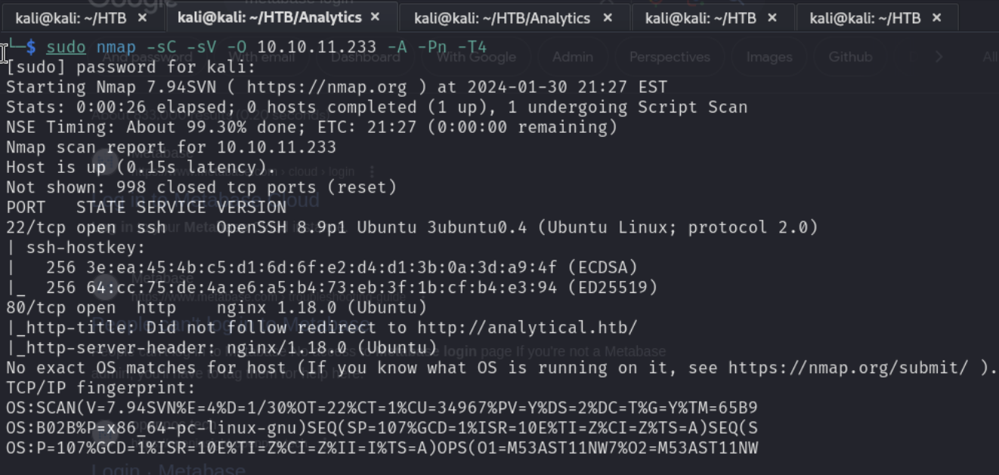
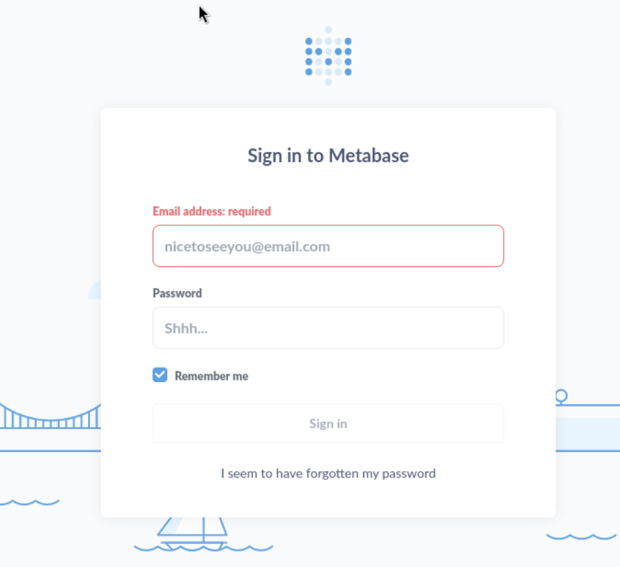
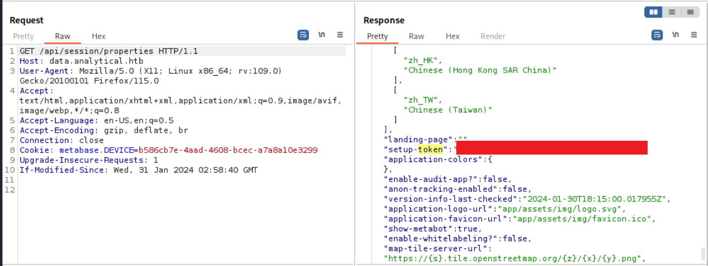
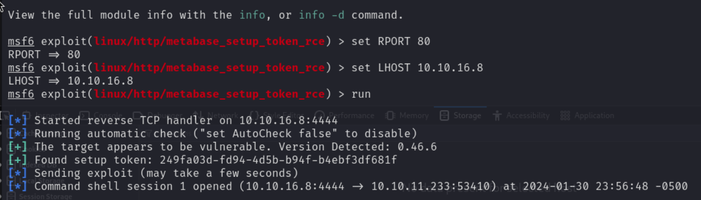
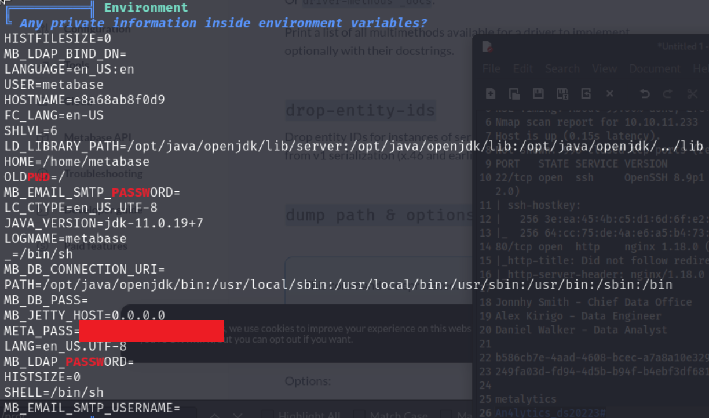

# Analytics - HTB

***

## Scanning and Enumeration

- Running nmap scans

    

- Running `ffuf`

- Found this login screen

    

***

## Research

- https://infosecwriteups.com/cve-2023-38646-metabase-pre-auth-rce-866220684396

***

## Initial Access

- Found the setup token using burp suite based on the previous article

    

- Found a metasploit exploit for this

    

***

## Privilege Escalation

- Transferred linpeas.sh and found some interesting info in the environment section

    
