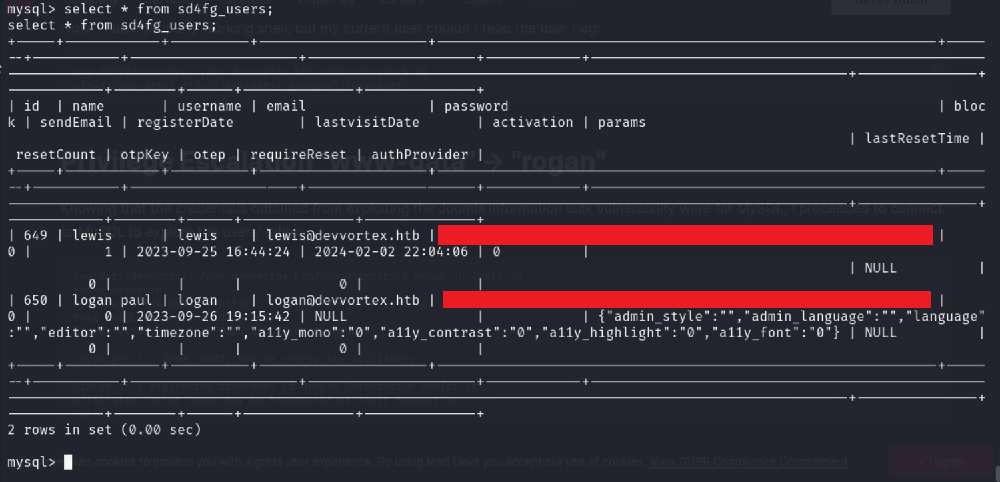

# Devvortex - HTB

***

## Scanning and Enumeration

- Running nmap scans

    

- Found a subdomain

    

- Navigated to `dev.devvortex.htb` and tried `robots.txt`

    

- Found a login screen at `/administrator`

    

- Ran `joomscan` against this to find more information

    

- From here found Joomla version `4.2.6` among other things

***

## Research

- https://github.com/Acceis/exploit-CVE-2023-23752
- https://github.com/diego-tella/CVE-2023-1326-PoC
- https://diegojoelcondoriquispe.medium.com/cve-2023-1326-poc-c8f2a59d0e00

***

## Initial Access

- Ran the exploit against `http://dev.devvortex.htb`

    

- These credentials allowed me to login to the joomla admin page

    

- Right off the bat we see this is running PHP so let's try to find where we can run some php code to get a shell

***

## Privilege Escalation

- Logged into the local joomla db using the credentials found for `lewis`

    

- Navigated to `joomla` database and found the table `sd4fg_users`. In there I found some hashes for `logan`

    

- Ran this through john the ripper and got a password
- Using those credentials, I was able to login as `logan`
- Found the `user.txt`
- Ran `sudo -l` and found that `logan` can run `apport-cli`
- Did some investigation and found a PoC for this privilege escalation (linked in resources)

    
