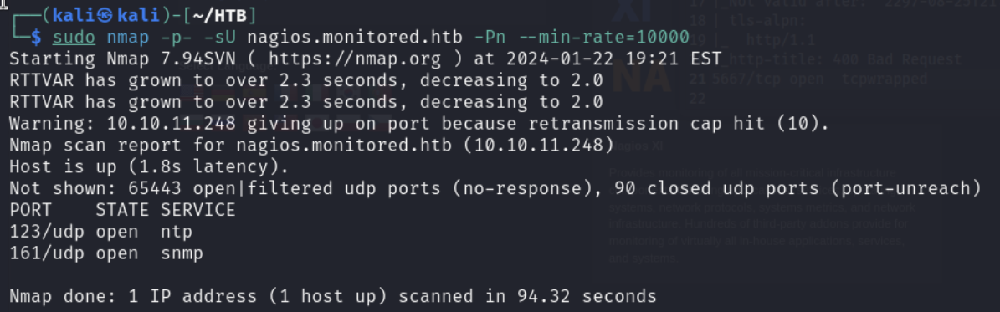
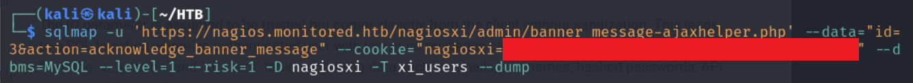

# Monitored - HTB

*** 

## Scanning and Enumeration

- Ran multiple nmap scans and got the following results

    
    

- Found the following login screen
  
    

- Found the following using ffuf

    

- Running ffuf again against `api`

    

- Running ffuf again against `api/v1/`
  - This resulted in a bunch of results but all where giving a size of 32 so used `-fs 32` to filter those out

- Run `snmpwalk` and found the following

    

***

## Research

- [SNMP Brute Force](https://book.hacktricks.xyz/generic-methodologies-and-resources/brute-force#snmp)

    

- [Nagios XI vulnerabilities](https://outpost24.com/blog/nagios-xi-vulnerabilities/)

*** 

## Initial Access

- Ran a post command on `/api/v1/authenticate` and the used the creds obtained from `snmpwalk`

    

- Obtained an auth token so went to login screen and passed on the token parameter, got logged in

    

- Found a sql injection

    

***

## Privilege Escalation
