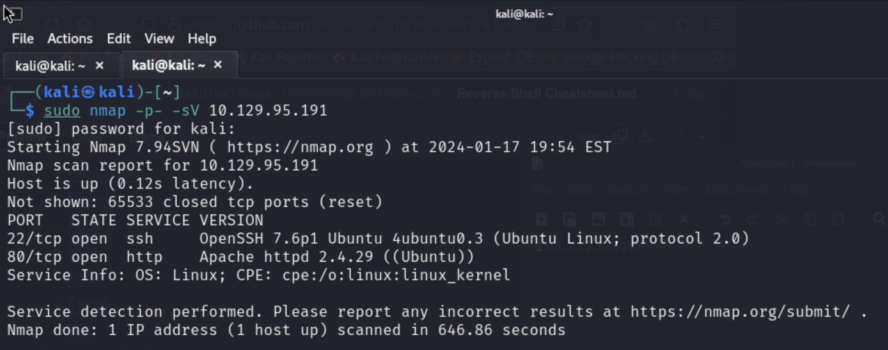
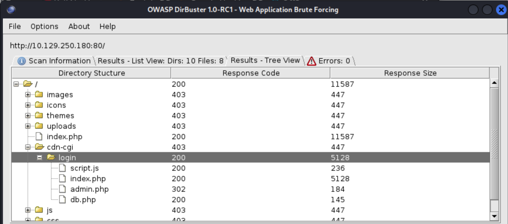
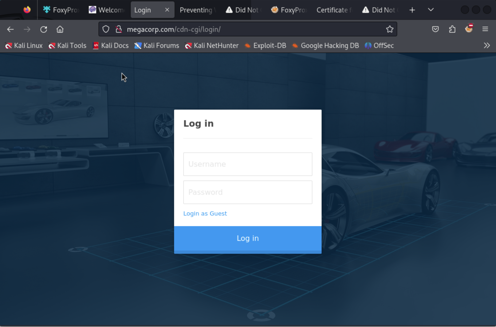
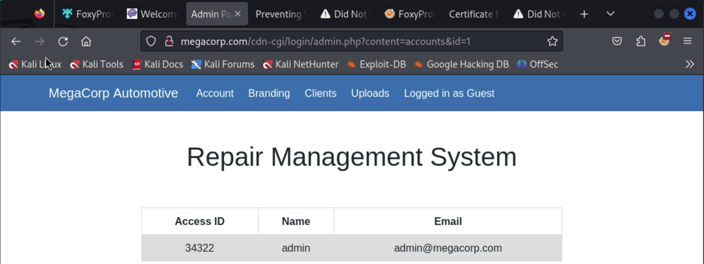
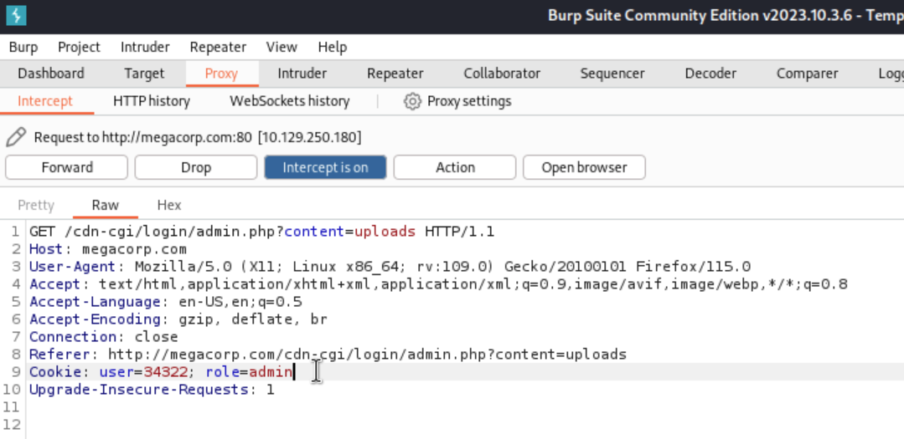
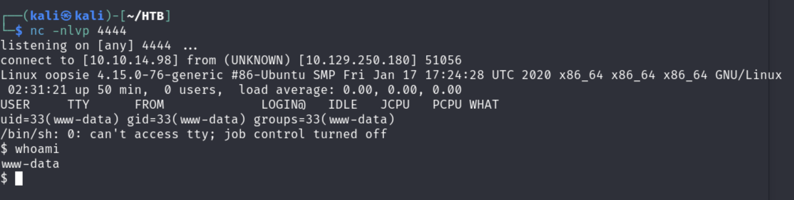
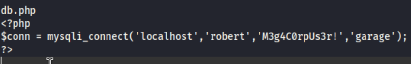
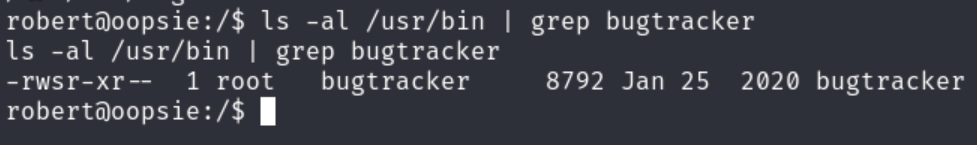
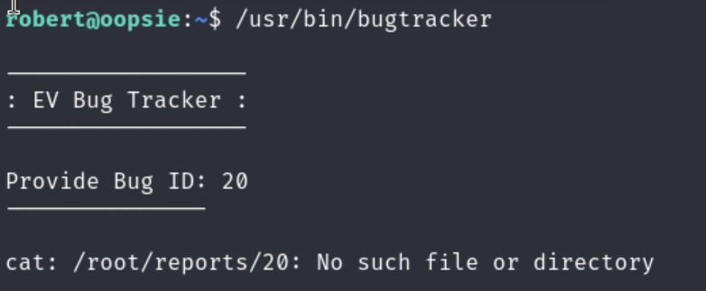
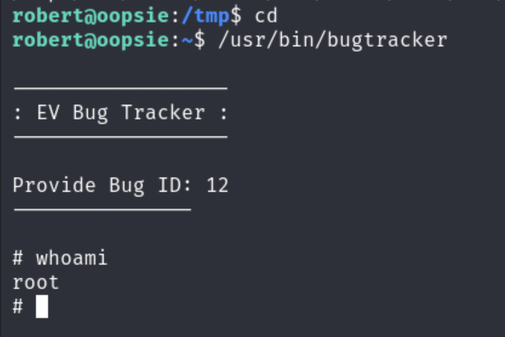

# Oopsie - HTB

***

## Scanning and Enumeration

- Running nmap scan against target machine

    

- Ran dirbuster to find any login pages

    

- Found the `/cdn-cgi/login` page 
  
    

- Logged in as Guest
- Noticed the url `content=accounts&id=2` and changed `id=1` which gave me the following

    

- Used the Admin ID found and turned on Burp Suite
- Navigated to the uploads page and intercepted the request
- Changed the `user` to `34322` and `role` to `admin`

    

- Manipulating the admin cookies, was able to upload a php reverse shell and got a shell session using a `nc` listener

    

- Found `db.php` file that contained the robert user password

    

- Switched to robert user and found he belongs to the `bugtracker` group
- Found an executable owned by the `bugtracker` group

    

- The executable has the SUID bit so it will run as root
- After running the `bugtracker` executable, we see the error message is calling the `cat` command but it doesn't define the path so this looks promising

    

- Created my own `cat` file containing the `/bin/sh` command in the `/tmp` folder
- Made this an executable and added `/tmp` to the `$PATH`
- Now when I ran `bugtracker` again, my fake `cat` will be run as `root` which will put me in a shell as `root`

    
