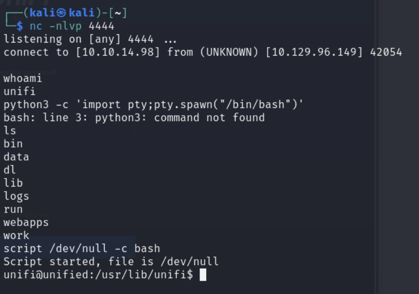
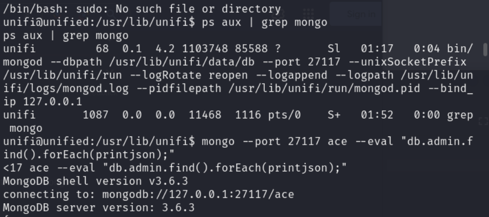
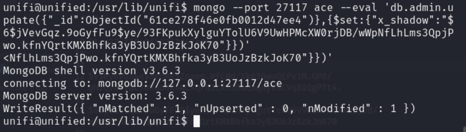
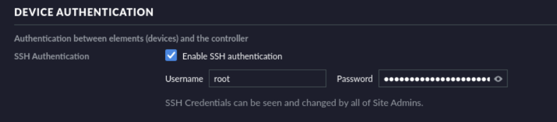
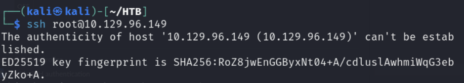

# TITLE HEADER

***

## Scanning and Enumeration

- Run nmap on the machine

***

## Research

- https://systemweakness.com/write-up-hack-the-box-starting-point-unified-tier-2-d4f3585320a1
- https://www.sprocketsecurity.com/resources/another-log4j-on-the-fire-unifi

***

## Initial Access

- Get an interactive shell

    

- Find mongo running and the default database unifi uses

    

- Created my own SHA-512 hash and updated the database for the admin user
  
    

- Login as admin to the portal

***

## Privilege Escalation

- Went to Settings > Site and saw there is an SSH authentication for the user `root` and the password

    

- After this we can SSH to the machine as root

    
