# Blackpearl - Provided by TCM 

- Box has ip address `10.0.2.14`

## Scanning and Enumeration

- Running `nmap` against target

    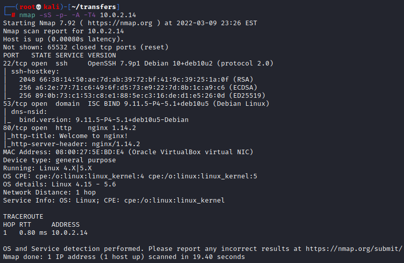

    - Interesting Findings
      - `22/tcp - open - ssh - OpenSSh 7.9p1 Debian (protocol 2.0)`
      - `53/tcp - open - domain ISC BIND 9.11.5-P4-5.1 (Debian Linux)`
      - `80/tcp - open - http nginx 1.14.2`

- Running `nikto` against the target

    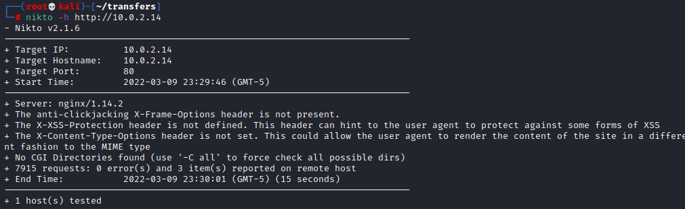

- Running `dirbuster` against the target - no interesting results there 

- Navigated to `http://10.0.2.14` and found the nginx default page 

    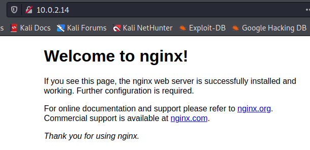

- Ran `gobuster` against the target and found: 

    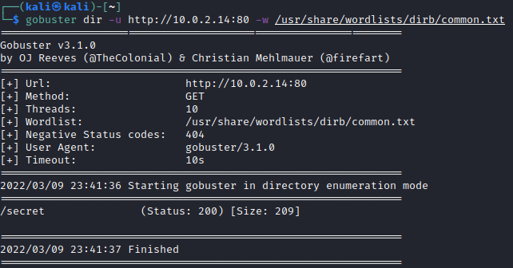

- Performing `dnsrecon` 

    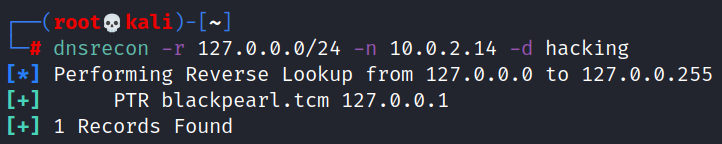

- Added `blackpearl.tcm` to `/etc/hosts/` 

    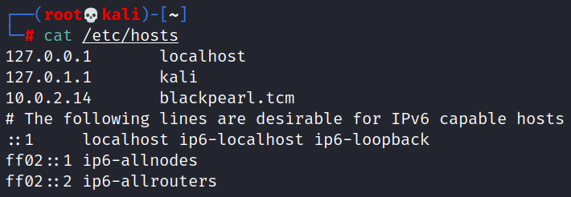

- Navigated to `blackpearl.tcm`

    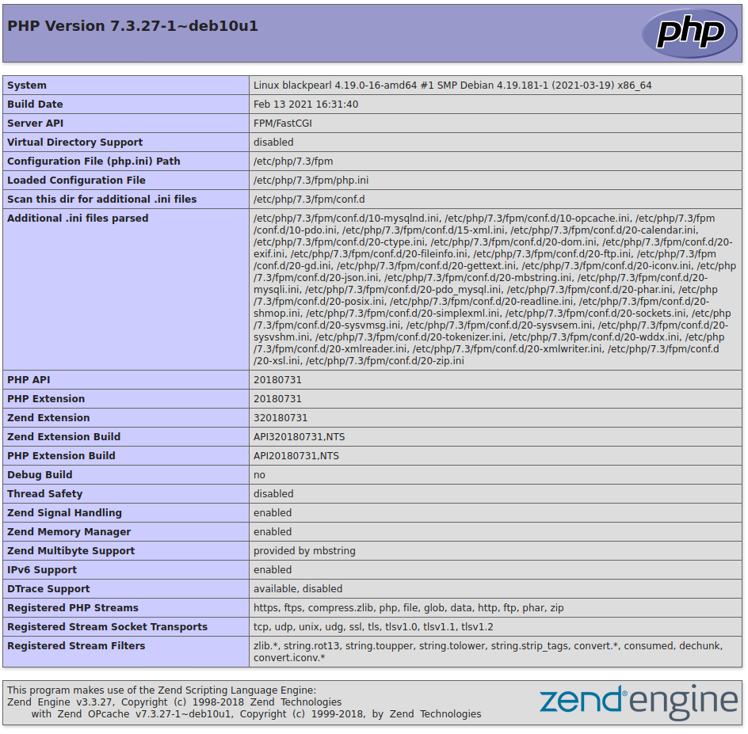

- Performed more directory brute forcing with `ffuf`

    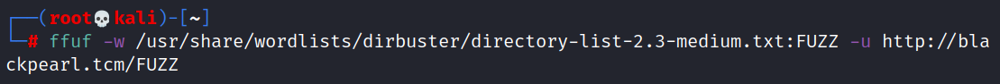

    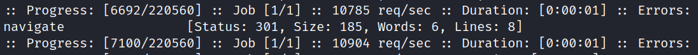

- Found `navigate` from `ffuf` so going to `blackpearl.tcm/navigate`

    

## Research

- Researched `Navigate CMS v2.8` exploits and found the following: 

    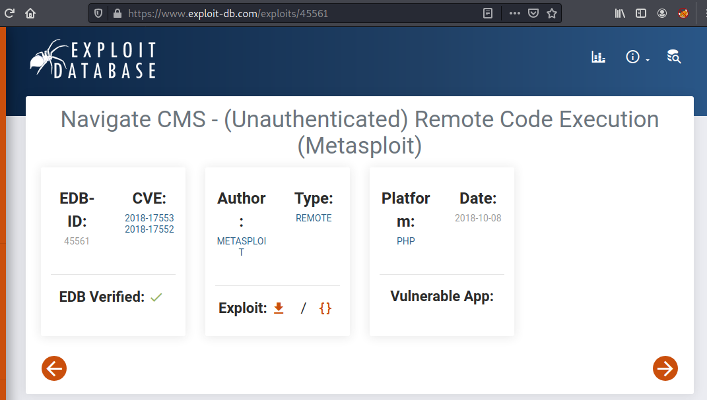

## Exploitation

- Searching `metasploit` for the module 

    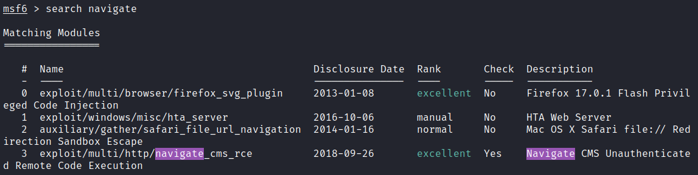

- Attempting to use module to attack the target

    

- Received a shell - moving on to privilege escalation 

    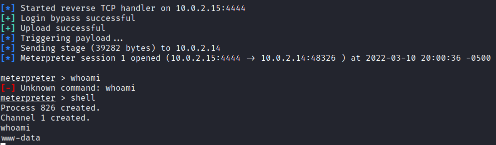

## Privilege Escalation

- Spawn a TTY shell using `python -c 'import pty; pty.spawn("/bin/bash")'`

    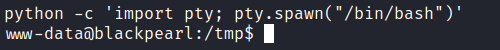

- Grabbed `linpeas.sh` from my attaching machine 

    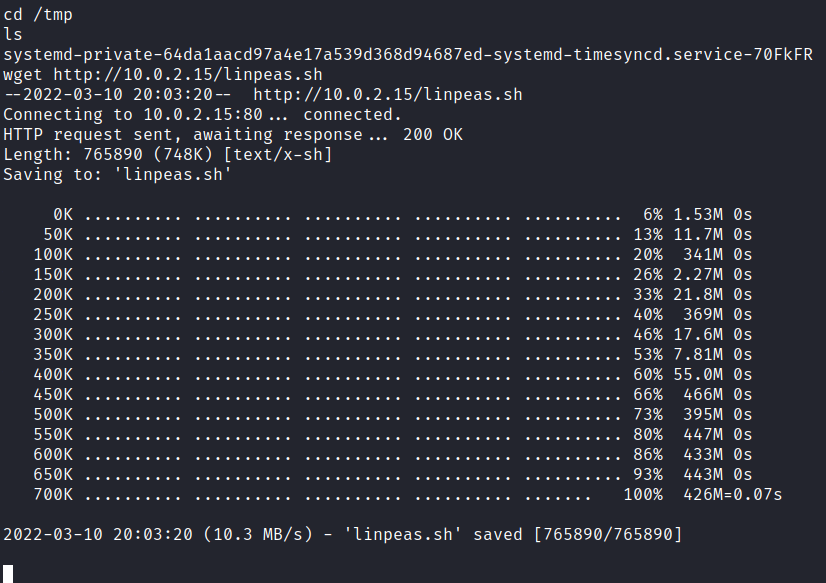

- Found an `(Unknown SUID binary)`

    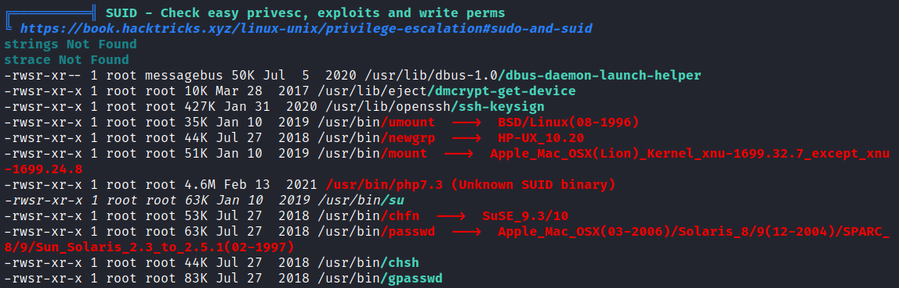

- Searched `gtfobins` for using `php` with `SUID` and found the following 

    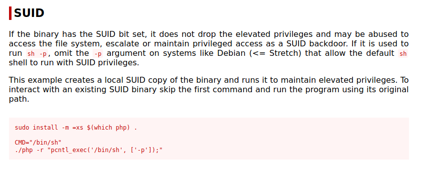

- Going to attempt this on the target 

    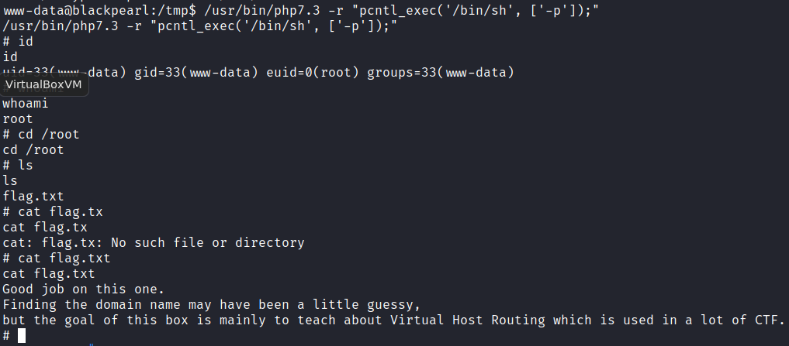

- Got root shell

