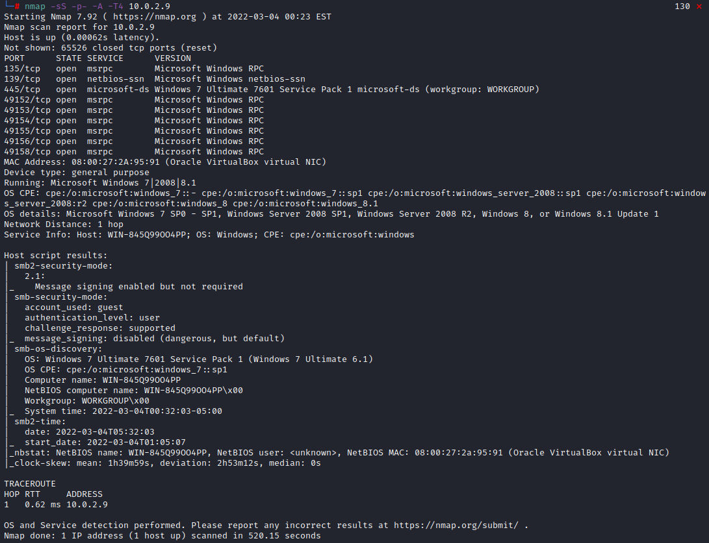
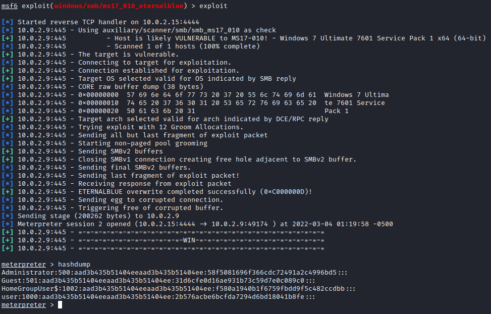

# Blue Box - Provided by TCM Security 

- Box has IP address `10.0.2.9`

## Scanning and Enumeration
- Running nmap against target machine

    

- Interesting Findings 
  - Port `139/tcp` - `netbios-ssn`
  - Port `445/tcp` - `microsoft-ds`
  - `smb2-security-mode: 2.1`
  - `smb-os-discovery`
    - OS: Windows 7 Ultimate 7601 Service Pack 1 (Windows 7 Ultimate 6.1)

- SMB Enumeration using Metasploit module `smb_version`
  
  

- SMB Enumeration using `smbclient`

    

## Research 
- Did some research for exploits related to `Windows 7 Ultimate 7601 Service Pack 1 (Windows 7 Ultimate 6.1)`
  - [MS17-010 EternalBlue SMB Remote Windows Kernel Pool Corruption](https://www.rapid7.com/db/modules/exploit/windows/smb/ms17_010_eternalblue/)
  - Searchsploit search 

    

## Exploitation

- Used Metasploit module `auxiliary/scanner/smb/smb_ms17_010` to check if target is vulnerable for found exploit 

    

- Seems like it is likely vulnerable so giving this a try

    

- Exploit was successful!
  - Popped a `meterpreter` shell and got a hash dump of the users on the 