# Butler - Provided by TCM

- Target has IP address of `10.0.2.80`

## Scanning and Enumeration

- Running nmap against target

    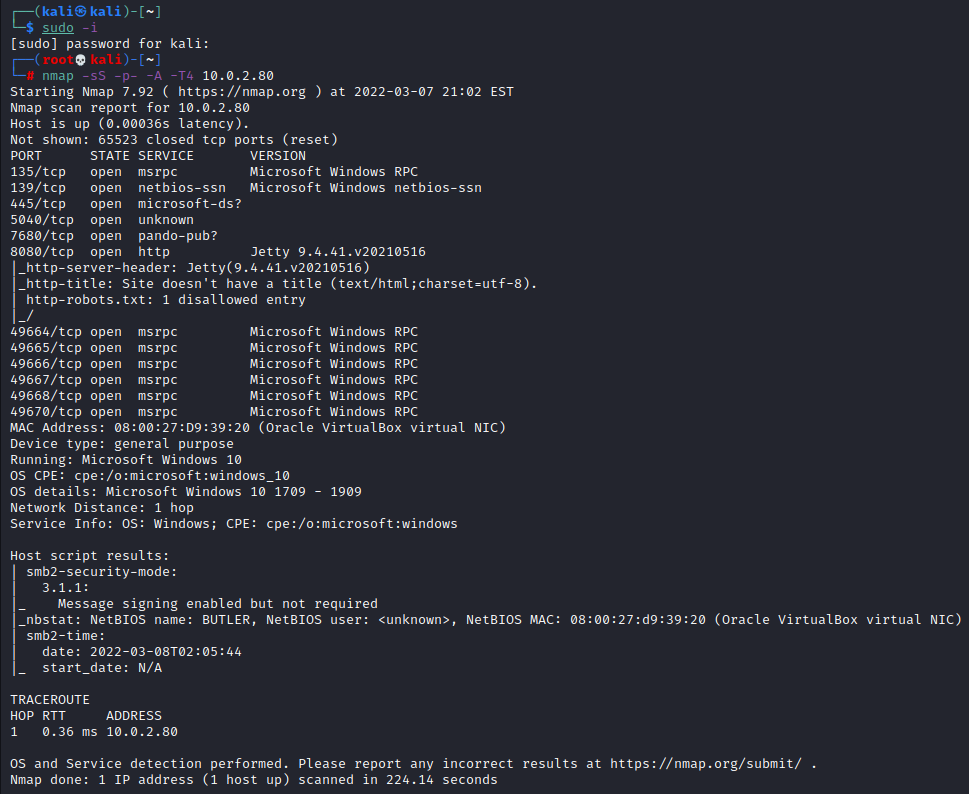

    - Interesting findings 
      - `135/tcp - open - msrpc`
      - `139/tcp - netbios-ssn`
      - `445/tcp - microsoft-ds`
      - `5040/tcp - unknown`
      - `7680/tcp - pando-pub`
      - `8080/tcp - http - Jetty 9.4.41.v20210516`
      - `49664-49668/tcp - msrpc`
      - `49670/tcp - msrpc`

- Running `nikto` against the target on port `8080`

    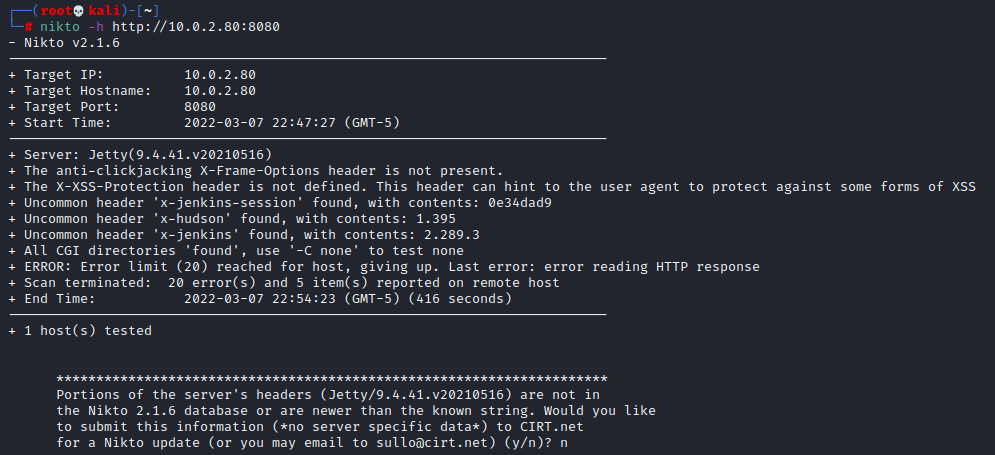

- Navigated to `http://10.0.2.80:8080` and got this page. 

    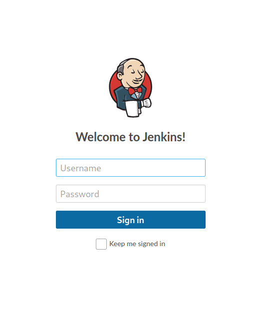

## Research

- Researching Jenkins exploits 
  - [pwn_jenkins](https://github.com/gquere/pwn_jenkins)

- Didn't find much else

## Exploitation

- Going to attempt to brute force the Jenkins login page using Burp Suite 

    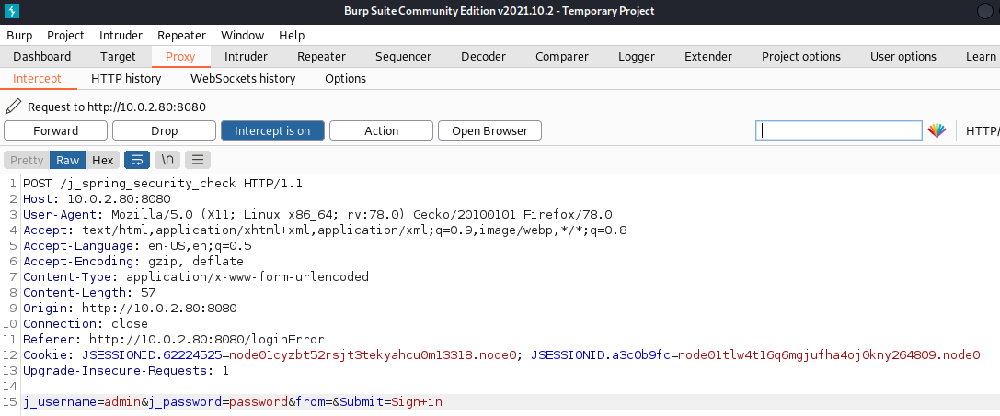

    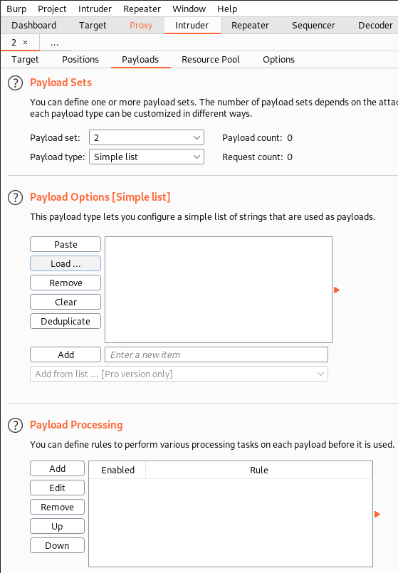

    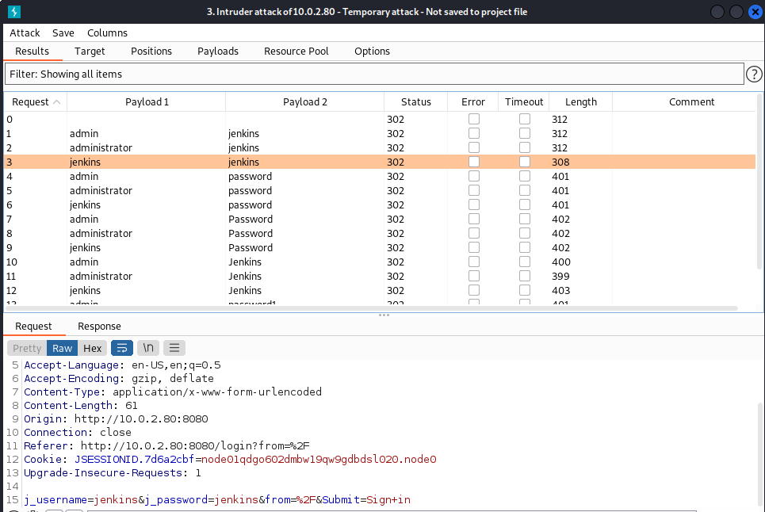
    - Seems like username: `jenkins` and password: `jenkins` works

    - Using [Groovy Reverse Shell](https://gist.github.com/frohoff/fed1ffaab9b9beeb1c76) on the Script Console
  
    - Set `netcat` to listen on port `8044` and got a shell 

    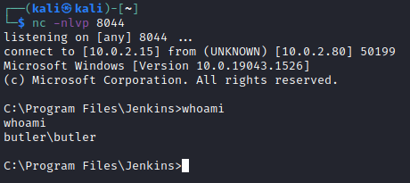

## Privilege Escalation

- Downloaded `winpeas.exe` and host a transfer file on my attack box 

    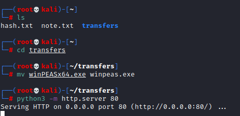

- Navigated to the `butler` user directory

    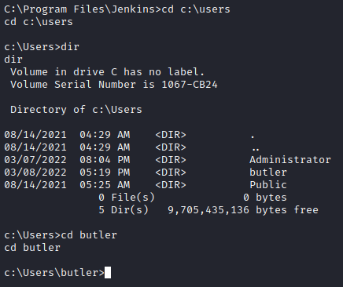

- Grabbed the `winpeas.exe` from the attacking machine using `certutil.exe`

    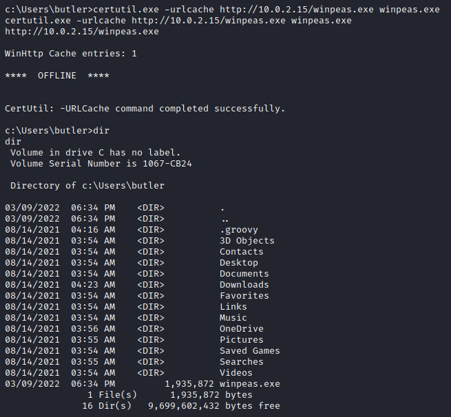

- Found an unquoted and unspaced service 

    

- Generated a malicious reverse shell file and named it `Wise.exe` using `msfvenom`

    

- Set `netcat` to listen on port `7777`

- Get the `Wise.exe` we created 

    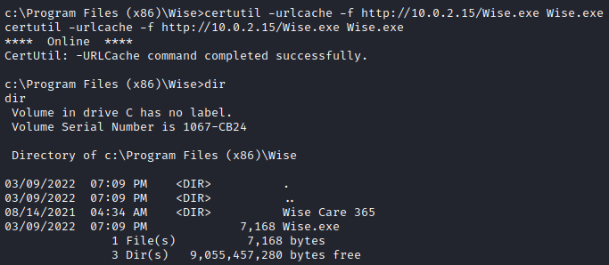

- Stop the running program `WiseBootAssistant` and confirm it is stopped 

    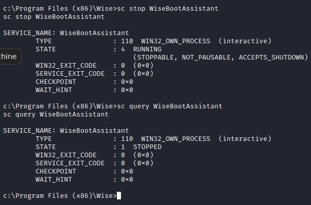

- Run our `Wise.exe` and it will execute as system 

    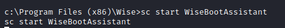

- We got a shell on port `7777` and see it is an elevated shell 

    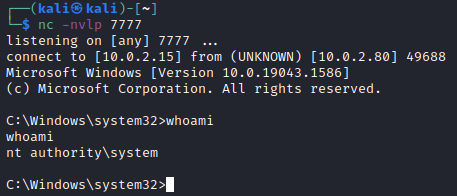