# Dev Box - Provided by TCM Security

- Box is using 10.0.2.11

## Scanning and Enumeration

- Running nmap against target

      

- Interesting Findings:
  - Port `22/tcp` open - SSH - OpenSSH 7.9p1 Debian (protocol 2.0)
  - Port `80/tcp` open - http - Apache httpd 2.4.38 ((Debian))
  - Port `111/tcp` open - rpcbind 2-4
  - Port `2049/tcp` open - nfs_acl 3 
  - Port `8080/tcp` open - http - Apache httpd 2.4.38 ((Debian))
    - `http-title`: PHP 7.3.27-1

- Running `nikto` since found Apache is running on the target

    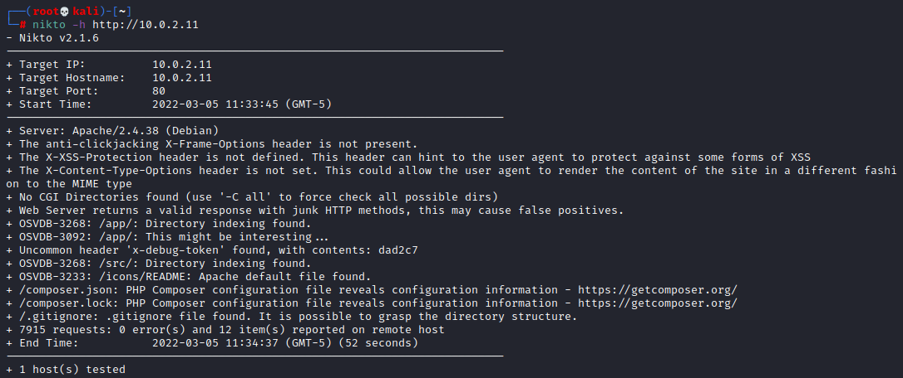

- Navigated to the site `http://10.0.2.11` and found this page

    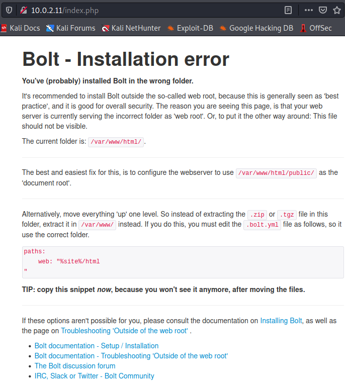

- Navigated to `http://10.0.2.11:8080` and found this page

    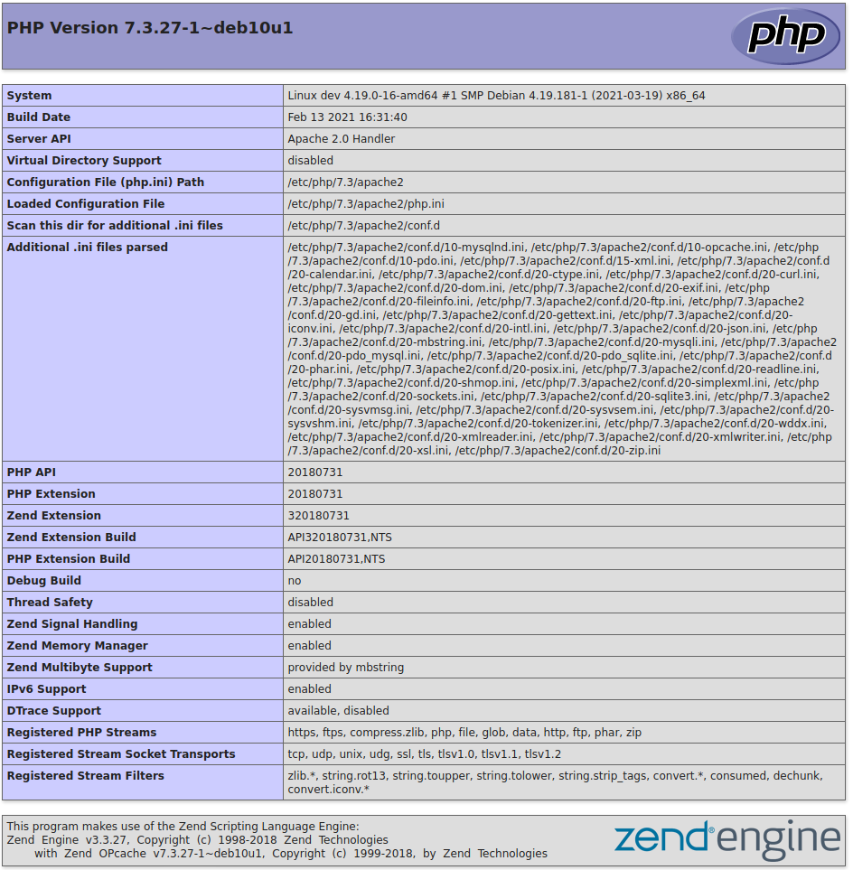

    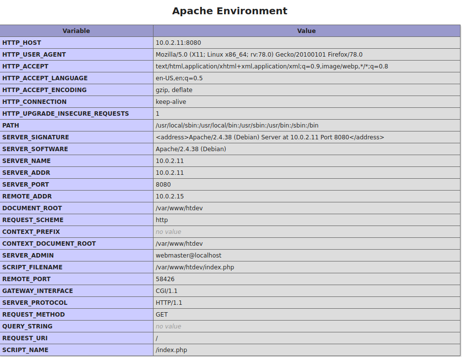

- Ran `dirbuster` against site

  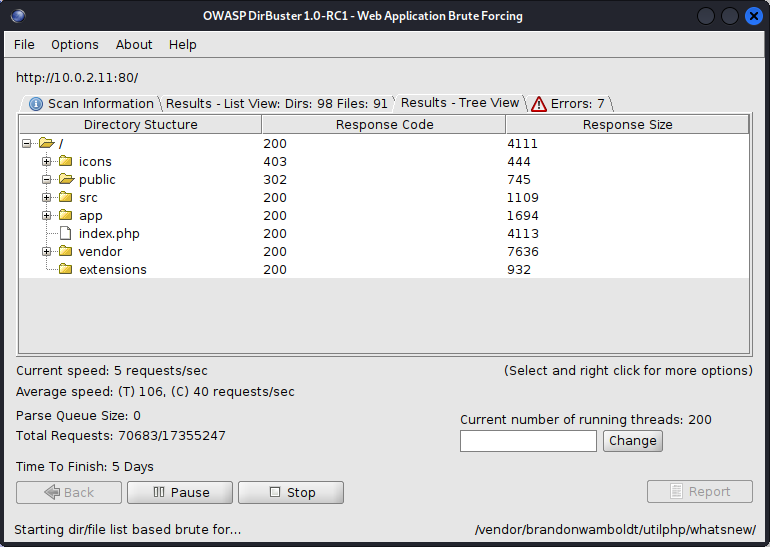

- Interesting findings 
  - `/index.php`
  - `/public/index.php`

- Navigated to `/public/index.php` page which was found using `dirbuster` and got this page 

  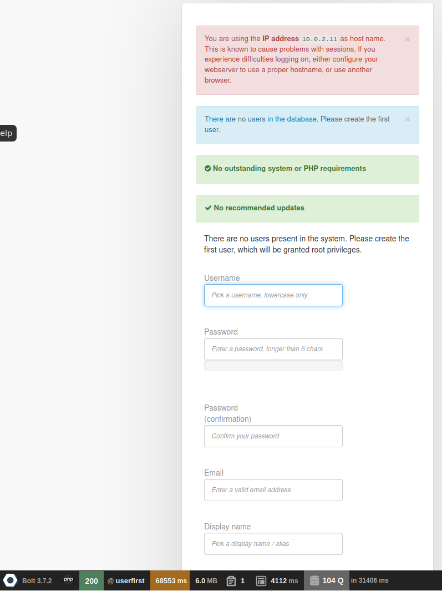

  - Interesting Findings 
    - `Bolt 3.7.2`
    - Seems like we can create a user and get root

- Listed `nfs` file share 

  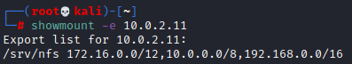

- Mounted file share found on `/srv/nfs` and found a `save.zip`

  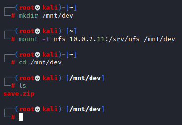

- Navigated to `/app/config` and found a `config.yml` file 

  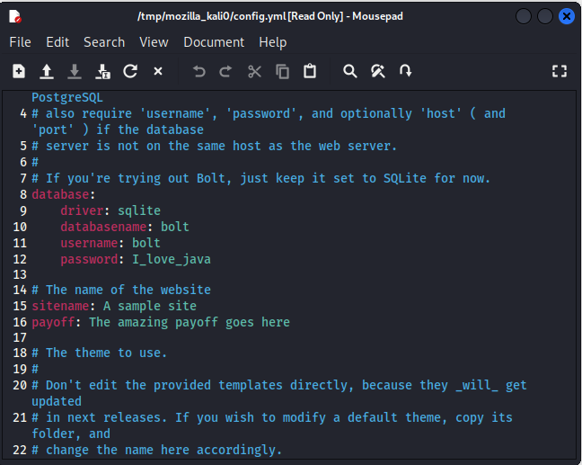

- Navigated to `http://10.0.2.11:8080/dev/` and found this screen

  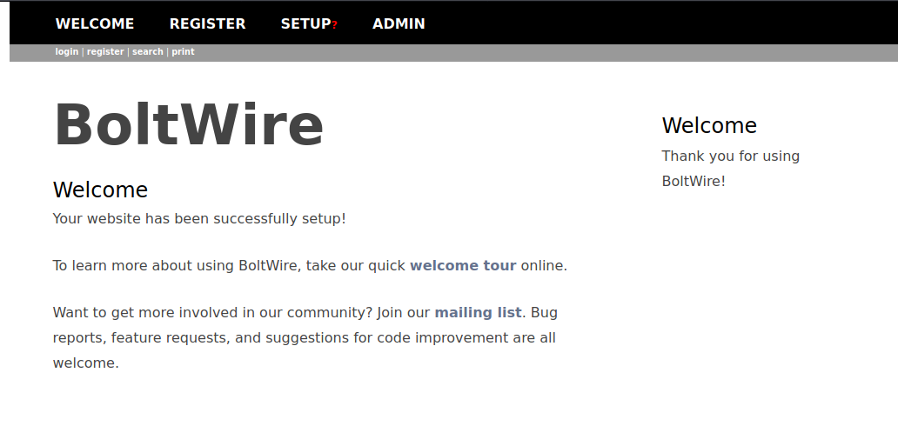

## Research

- What is Bolt? 
  - Looks like Bolt is CMS software - [Bolt CMS](https://boltcms.io/)
  
- Researching vulnerabilities for `PHP Version 7.3.27-1` 
  - [PHP Vulnerability: CVE-2021-21702](https://www.rapid7.com/db/vulnerabilities/php-cve-2021-21702/)

- Researching vulnerabilities for `Bolt CMS` using `searchsploit` and `Metasploit`

    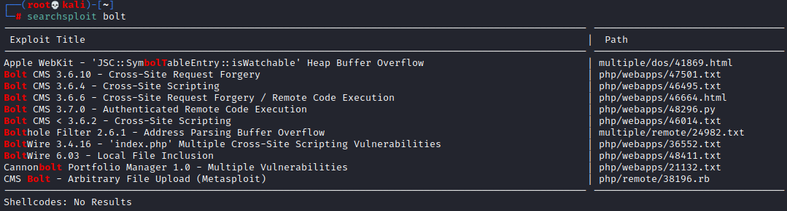

    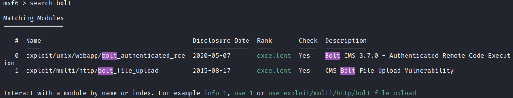

- Researching vulnerabilities for `Apache/2.4.38 (Debian)`
  - [Vulmon](https://vulmon.com/searchpage?q=apache+http+server+2.4.38)

  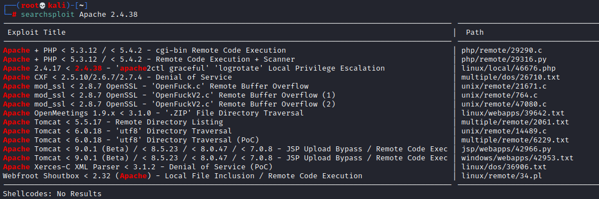

- Researching vulnerabilities for `BoltWire` 
  - [BoltWire Local File Inclusion](https://www.exploit-db.com/exploits/48411)

## Exploitation

### Bolt
- Trying to create a user using the page found at `/public/index.php`
- This was successful but not sure what I can do from here. 

  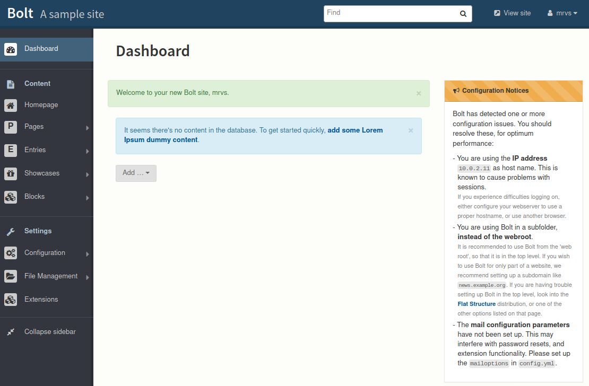

- Tried using the `unix/webapp/bolt_authenticated_rce` module but this failed 

  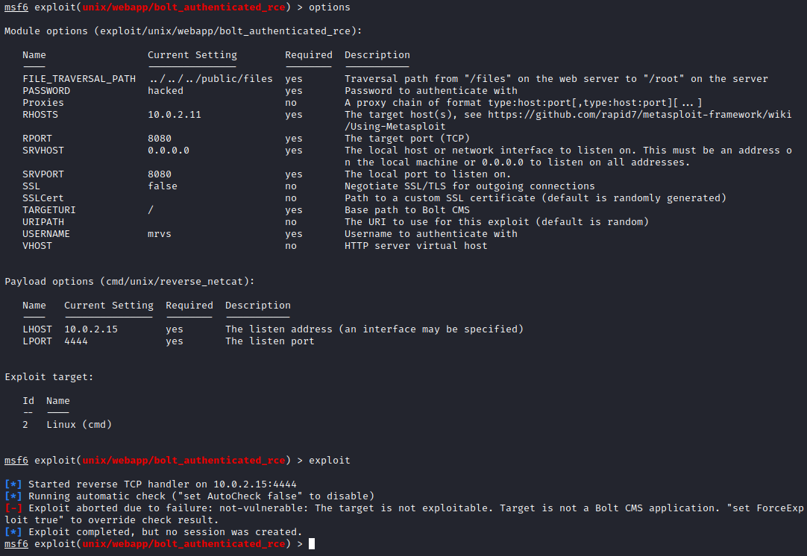

### File Share
- Attempt to crack file share using `fcrackzip`

  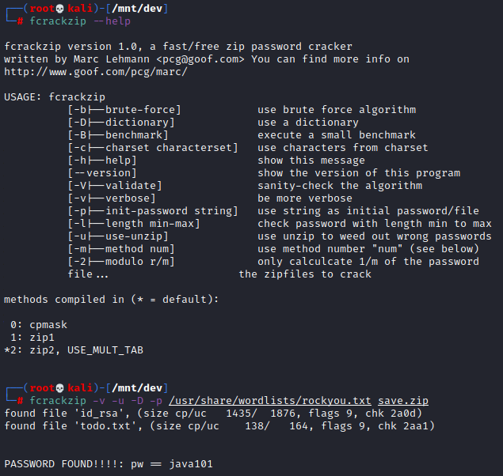

- Found the password so using that to unzip the file
- Zip file contained: 

  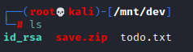

### BoltWire 
- Attempting local file inclusion on the page found
- First created a user so that we are authenticated
- Pasted `index.php?p=action.search&action=../../../../../../../etc/passwd` at the end of the URL and it worked. We got the contents of `/etc/passwd` 

  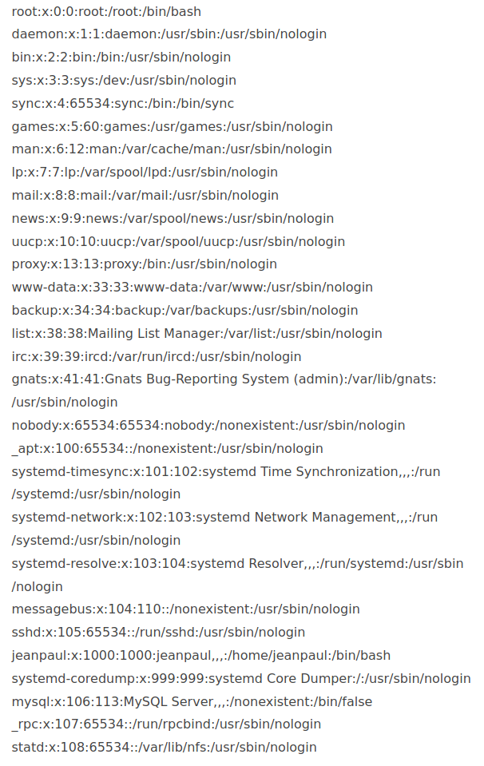

  - Found a user `jeanpaul` which we found before as `jp`

### SSH 
- Putting together the information so far we can try to SSH to the machine 
  - User: `jeanpaul` 
  - Found a line in the `todo.txt` that says `jeanpaul` loves `java` and a password in the `config.yml` file of `I_love_java` so I'm going to give that a shot.
  - Going to use the `id_rsa` file we found

  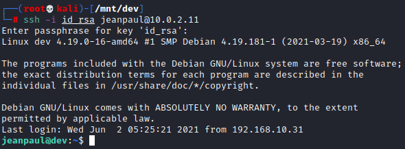

  - This worked so now we have a shell on the target

# Privilege Escalation

- Do a `sudo` check to see what we can run without password

  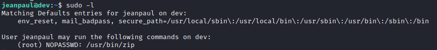

- Found we can run `sudo /usr/bin/zip` with `NOPASSWD`
- Went to [GTFOBins](https://gtfobins.github.io/) to figure out how to leverage this

  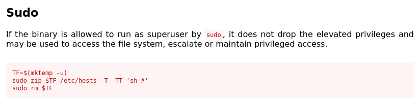

- Attempting this on the target

  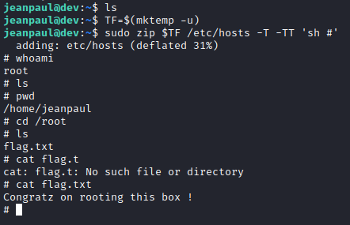

- Box was rooted! 

