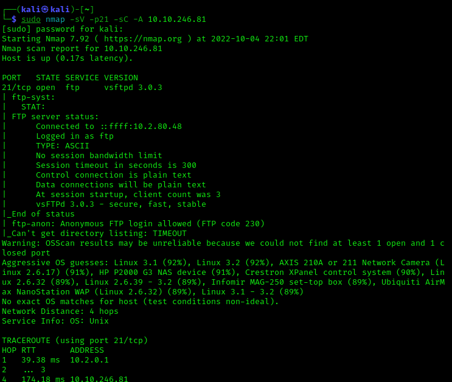
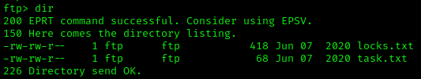

# Bounty Hacker

## Nmap scan

## Initial access

- Found `ftp` open and allowing anonymous logins

- Got `locks.txt` and `task.txt`
- Found a username

- Use `hydra` to brute force `ssh`
  `hydra -l <USER> -P locks.txt ssh://<IP>`

  