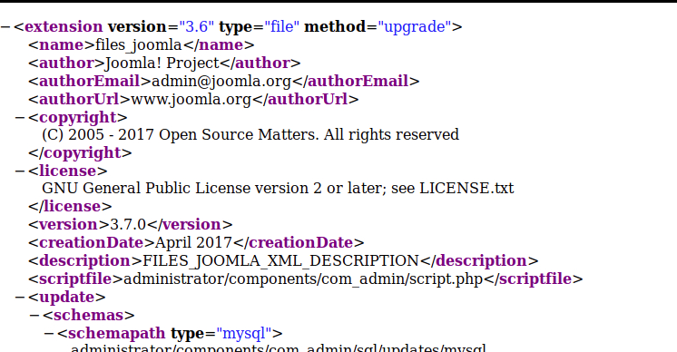
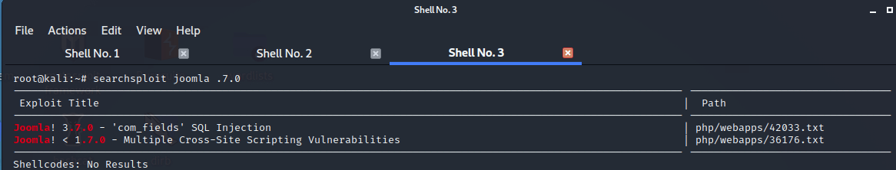
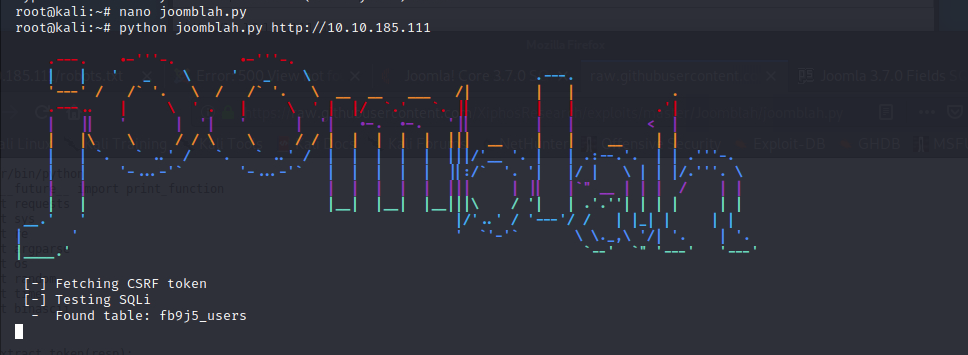
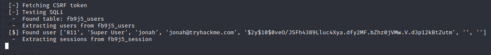
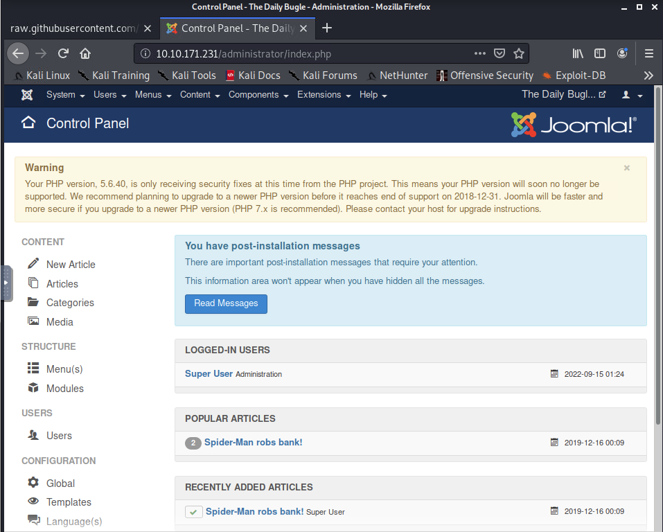
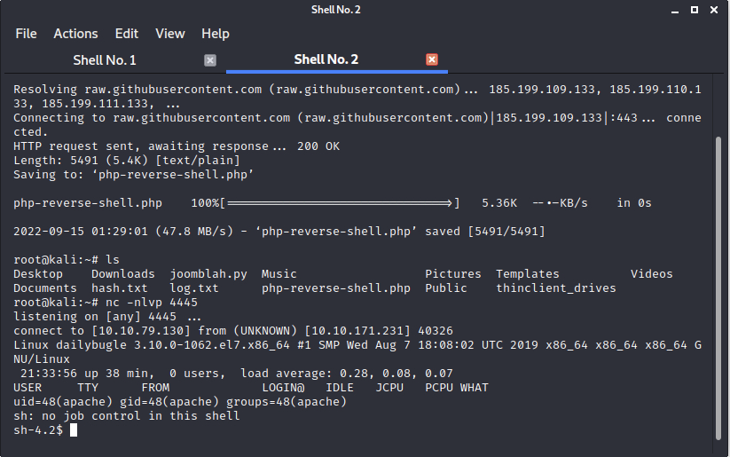
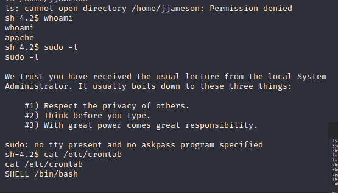
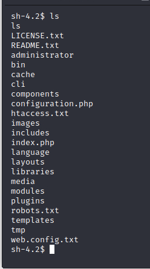
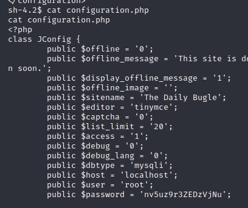
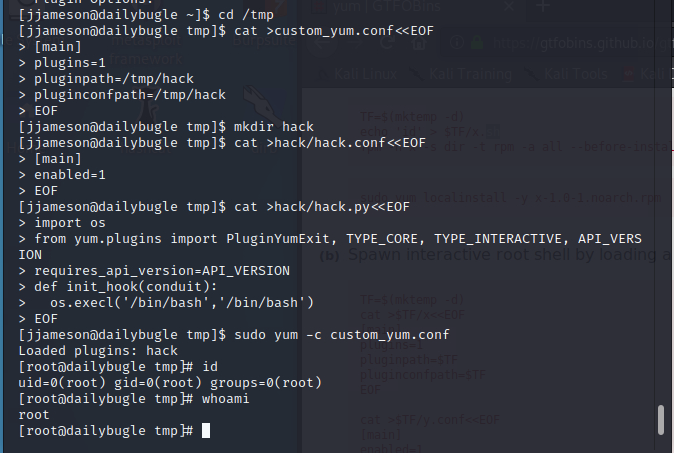

# Daily Bugle

# Joomla Recon

- Found the Joomla version by going to this URL: http://10.10.185.111/administrator/manifests/files/joomla.xml

    

- Found the following vulnerabilities
  
    

- Downloaded a python script to exploit one of the vulnerabilities from here: https://github.com/XiphosResearch/exploits/tree/master/Joomblah

    

- Found the following information (user, email and hash)

    

- Time to crack the hash using john the ripper
- Once we have the password, use this to login to the joomla portal.

    

- Time to get a reverse shell from [here](https://github.com/pentestmonkey/php-reverse-shell/blob/master/php-reverse-shell.php)
- Load the `reverse php` shell code onto the index.php file and then reload the website. 
- At the same time start a listener using `nc -nlvp 4445` to get a shell

    

- The shell we got is for username `apache` and has no sudo privileges

    

- Also was not able to switch user `jjameson` using the password we cracked

- Found nothing on crontab useful to escalate
- Next step, let's look at web files in `/var/www/html/`

    

- Found a `web.config.txt` and `configuration.php` files that looks interesting
- `configuration.php` contains some passwords!

    

- Tried this to switch to root but it failed. 
- Tried it for user `jjameson` and that works!
- Figured out the yum escalation from [GTFOBins](https://gtfobins.github.io/gtfobins/yum/)

    