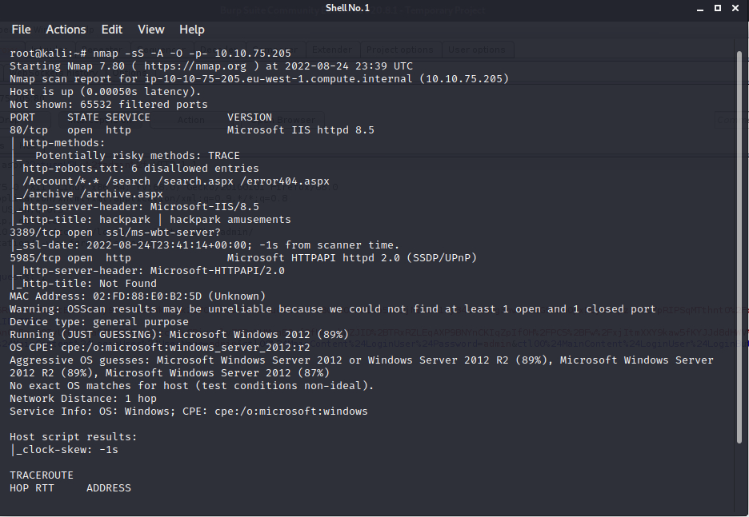
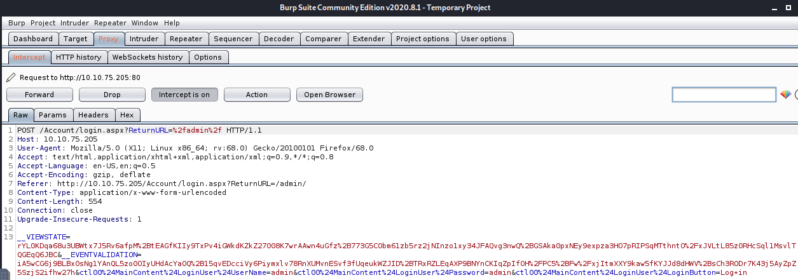

# HackPark

## Initial Scan 
- Ran nmap against the target machine 

    

## Hydra Brute-force 

- Use `Burp Suite` to identify the request type the website login forms uses 

    

- Now that we know it uses a `POST` request, we can use `HYDRA` to brute force 

`