# HackPark

## Initial Scan

- Ran nmap against the target machine

    

## Hydra Brute-force

- Use `Burp Suite` to identify the request type the website login forms uses

    

- Now that we know it uses a `POST` request, we can use `HYDRA` to brute force using this command
  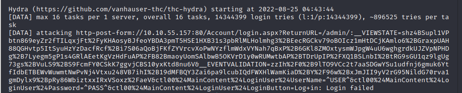

  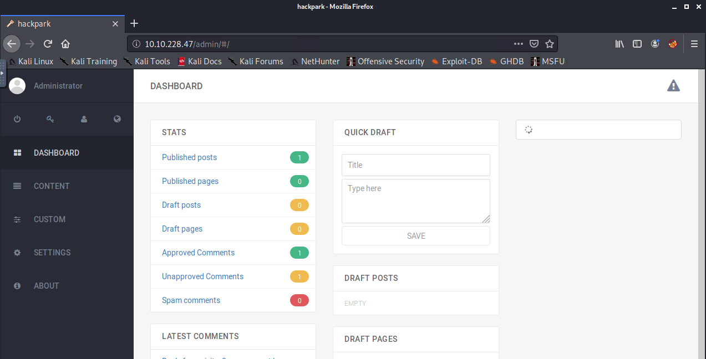

- Once logged in we can identify the version of BlogEngine (3.3.6.0)
- Use exploit-db.com to find vulnerabilities for this version of BlogEngine
  - Found [CVE](https://www.exploit-db.com/exploits/46353)

- Download the exploit and name the file `PostView.ascx` 
- Upload it to one of the posts. 

    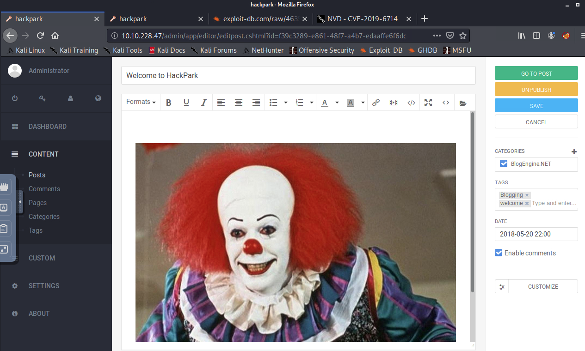

- Set up a listener using `nc -nlvp 4445`
- Navigated to the URL in the exploit and received a call back on the reverse shell

    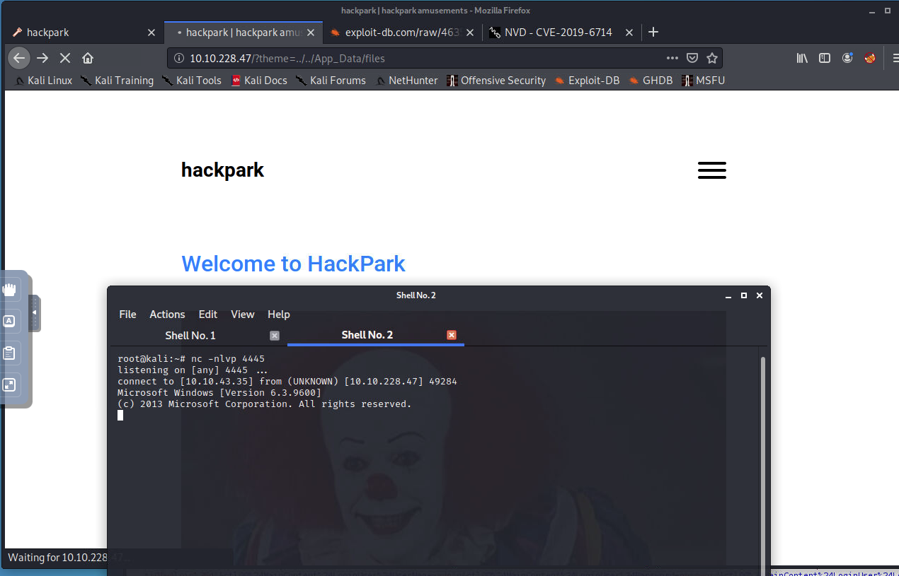

- Found who is the webserver running as using `whoami` command
- Setup meterpreter listener
    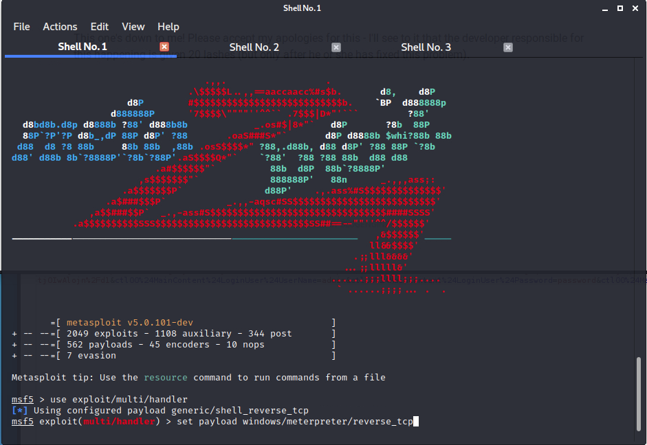
- Download payload
    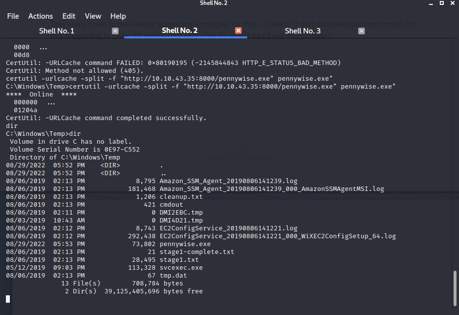
- Gaining Meterpreter shell 
    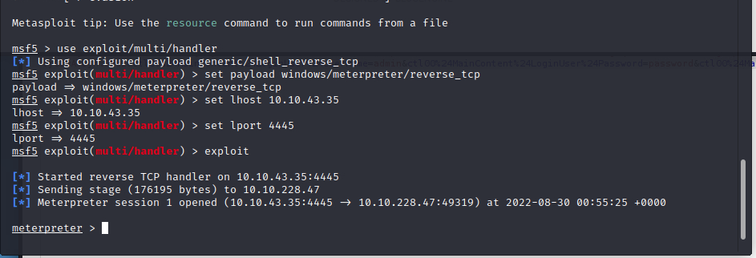
- Executing malicious payload
    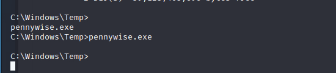
- Gaining additional system information
    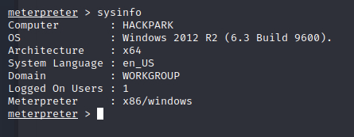
- Uploading winPEAS.exe
    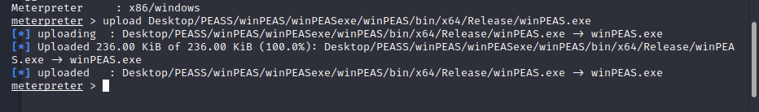
- Investigating abnormal services
    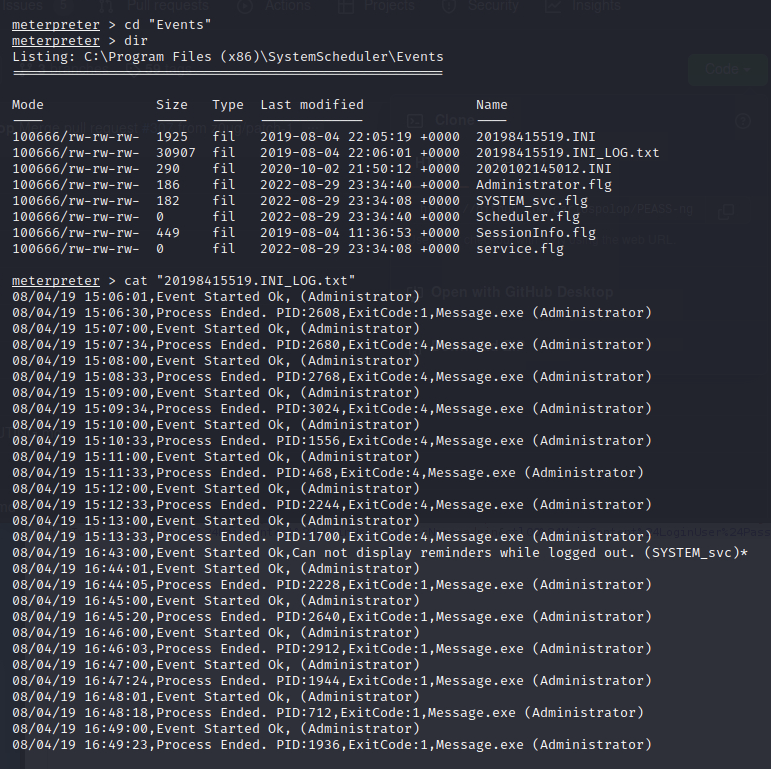
- Generating malicious payload with `msfvenom`
    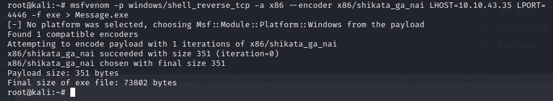
- Downloading `msfvenom` payload
    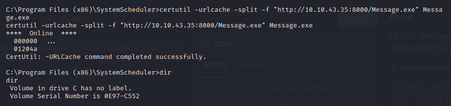
- Setup listener
    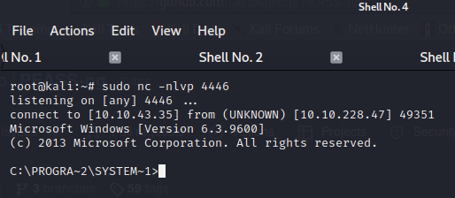
- Finding user and root flags
    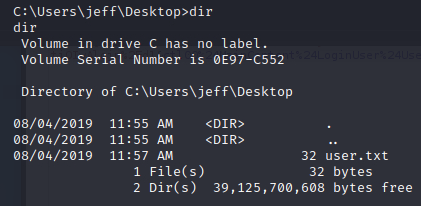