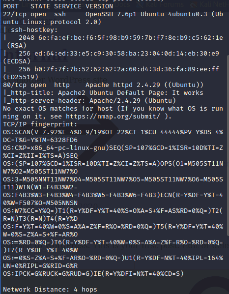
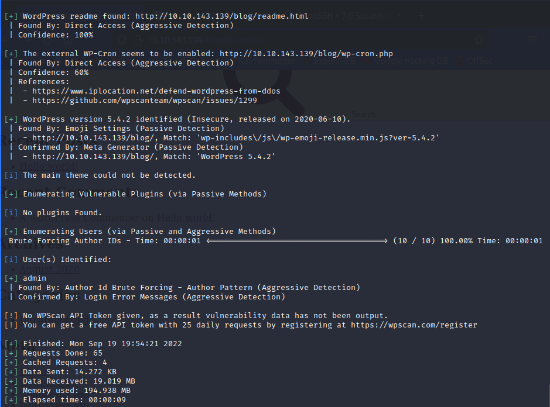

# Internal

## Reconaissance
- Nmap Scan Results

    

- Services to Investigate
  - `OpenSSH 7.6p1`
  - `Apache 2.4.29`

- Use `WPScan`

    

- Found the user `admin` so now we can use `WPScan` bruteforce function
  `wpscan --url 10.10.24.133 --usernames admin --passwords /usr/share/wordlists/rockyou.txt --max-threads 50`
- From this we found a password for the `admin` user
