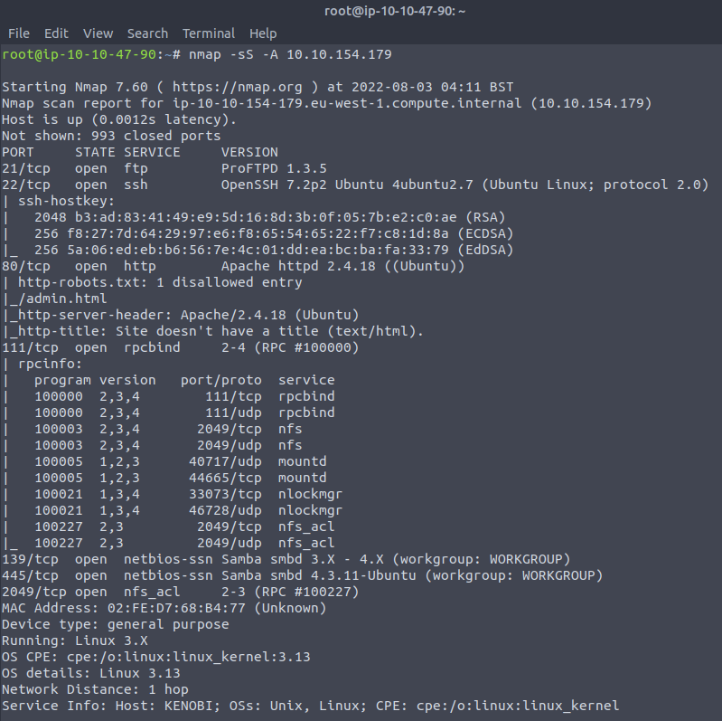
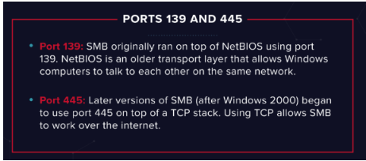
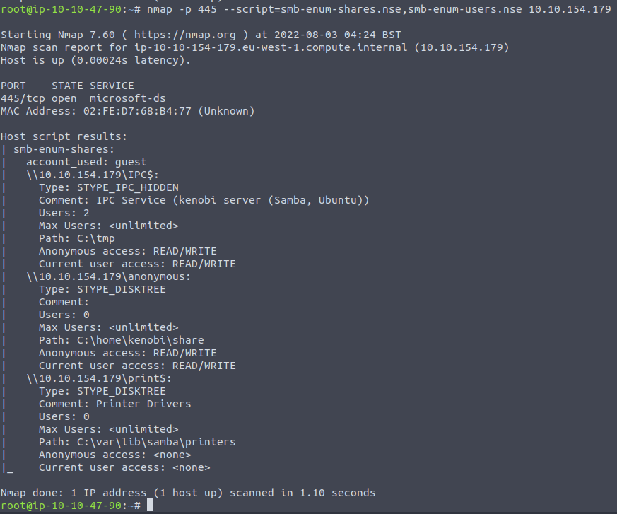
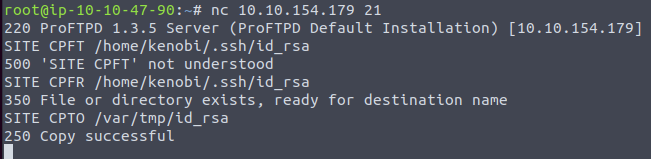
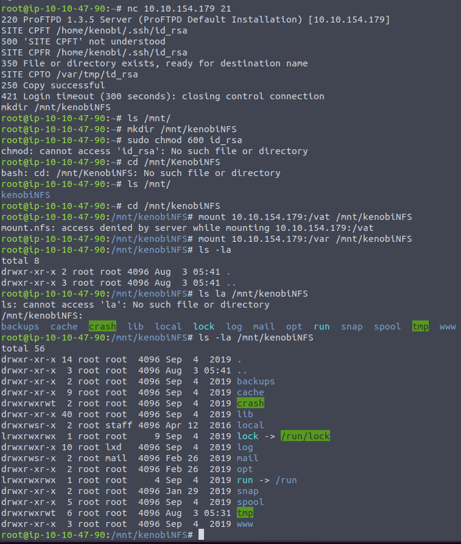
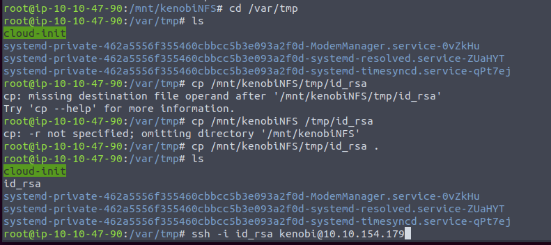
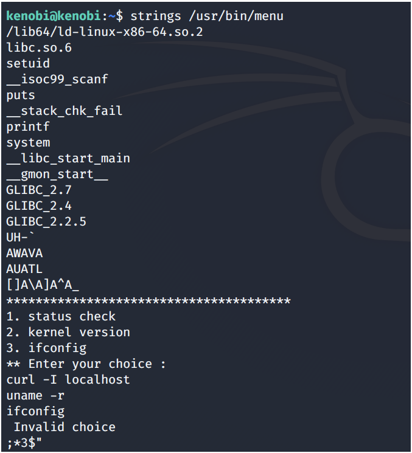
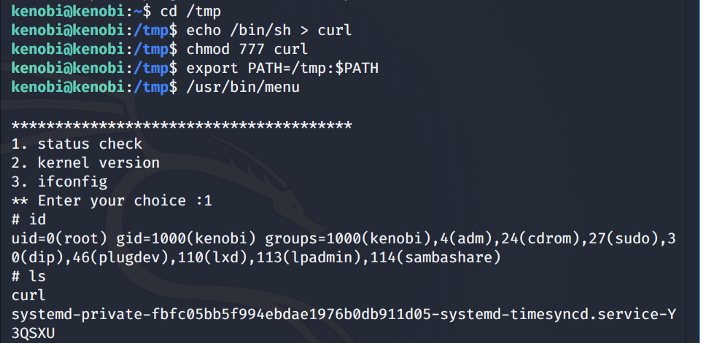

# Kenobi

## Nmap Scan



## Enumerating SAMBA shares

- Use the `nmap` script engine to enumerate SMB shares
```nmap -p 445 --script=linpas-enum-shares.nse,smb-enum-users.nse x.x.x.x```





- Connect to shares `smbclient`
```smbclient//<ip>/anonymous```

- Recursively download the SMB share. Submit username and password as nothing
```smbget -R smb://<ip>/anonymous```

- `rpcbind` converts remote procedure call (RPC) program number into universal addresses. When an RPC service is started, it tells `rpcbind` the address at which it is listening and the RPC bind program number its prepared to serve

## Gain initial access using ProFtpd

- Use `netcat` to connect to the machine on the FTP port `21`
```nc x.x.x.x 21```

- Use `searchsploit` to search for exploits of this version
```searchsploit proftpd 1.3.5```

- `mod_copy`module implements **SITE CPFR** and **SITE CPTO** commands
  - These can be used to copy files/directories from one place to another on the server.
  - Any authenticated client can leverage these commands to copy files from any part of the filesystem to a chosen destination

- Copy Kenobi's private key using **SITE CPFR** and **SITE CPTO** commands



- Mount the `/var/tmp` directory to the machine

```mkdir /mnt/kenobiNFS```
```mount machine_ip:/var/mnt/kenobiNFS```
```ls -la /mnt/kenobiNFS```





## Privilege Escalation with Path Variable Manipulation

- Search for files with SUID set
```find / -perm -u=s -type f 2>/dev/null```

- `/usr/bin/menu` stands out from the list 
- Use `strings` to find human-readable string in the binary



- We found that `curl` is being run with the full path so we can manipulate the path to gain root 


