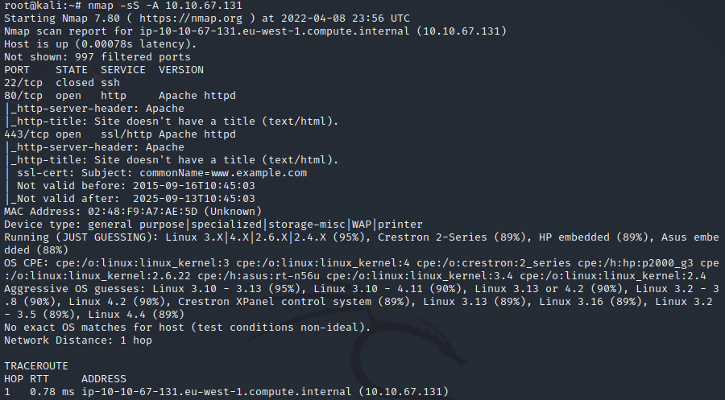
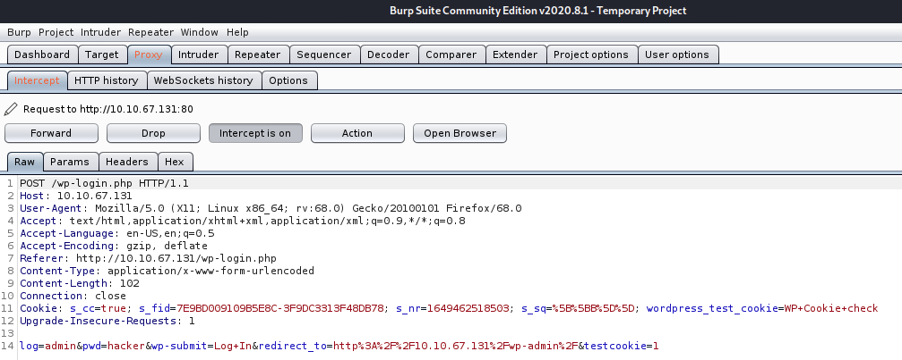
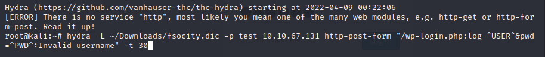
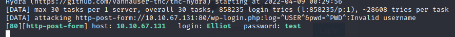

# Mr. Robot - Provided by TryHackMe

---

- Box is using 10.10.67.131

## Scanning

- Using nmap to scan for running services and ports

    

## Investigation

- Navigated to the `/robots.txt` file and found the following which gave me the first key

- Went ahead and downloaded the `fsocity.dic` file
- The file seems to be a username list

- Using burp suite, figured out the username and password are passed in the POST request

    

- Then using hydra and the `fsocity.dic` file, conduct a brute force attack

    

- This returned with username `Elliot`
    

- Running the same attack with the known username `Elliot`
