# Overpass 3 - Hosting

## Reconnaisance

- Nmap Scan Results

    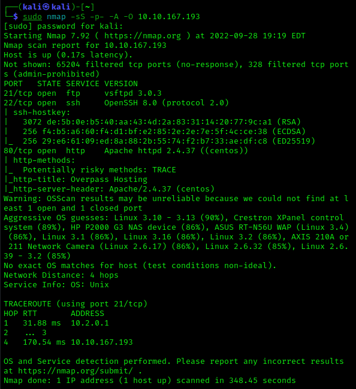

- Dirsearch scan found the following directories
  - `/backups`
  - `/cgi-bin`

- Navigating to `/backups` we find a `backup.zip` file.
- After downloading it and unzipping it we find it contains two files:
  - `priv.key`  
  - `CustomerDetails.xlsx.gpg`

- Use the `gpg --import priv.key` command to import the private key
- Decrypt the file using the `gpg --decrypt CustomerDetails.xlsx.gpg > CustomerDetails.xlsx` command
- Once we open the file we find a spreadsheet with username and passwords. Jackpot!

## Initial Access

- Let's try to ssh using the `paradox` user and the password found in the spreadsheet.
  - This doesn't work because we need a key
- We found port `21 ftp` was open from our nmap scan so let's try that instead
  - We are in!

    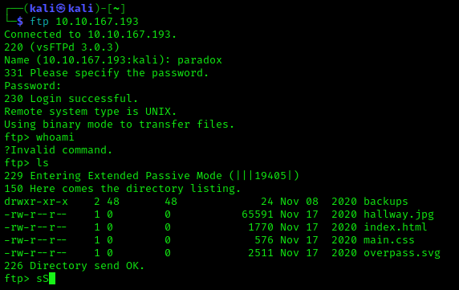

- Let's upload a php reverse shell and start a listener using `nc -nlvp 6666`

    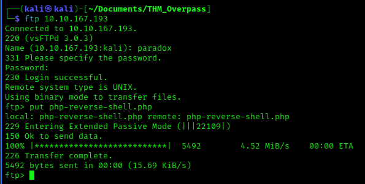

- Navigate to `10.10.167.193/php-reverse-shell.php` and we have a shell! 

    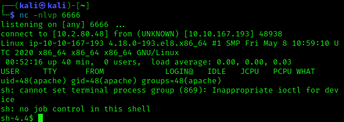

- Let's get an interactive shell
   `python -c 'import pty;pty.spawn("/bin/bash")'`

   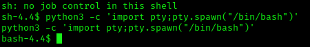

- We found two users on the box:
  - `/home/james`
  - `/home/paradox`

- We have the `paradox` user password so let's try to switch to that user
  - That works, so now we have access to the user directory
  - There we find the `.ssh/authorized_keys` file.
  - Let's generate a ssh key pair and put the public key on the `authorized_keys` file to gain persistent access.
  
  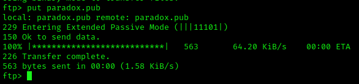
  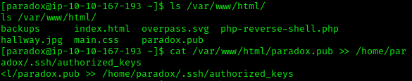

- Works!
  

- Since we have ftp access let's upload `linpeas.sh` and run it to find privilege escalations
- Looks like a NFS is misconfigured with `no_root_squash`

    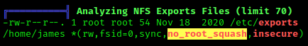

- Since we already have a ssh key on the target we should be able to mount this NFS using SSH tunneling

- First let's find which port NFS is listening on using `rpcinfo -p`
  - Looks like it is using port `2049`

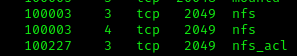

- Setup SSH port forwarding
  `ssh -i paradox paradox@10.10.167.193 -L 2049:localhost:2049`

- Now using `root` we can mount this and we find the user flag!

    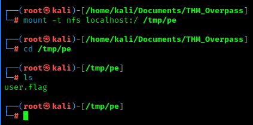

## Privilege Escalation

- Now let's escalate our privileges!
- First let's copy `/bin/bash` to the NFS
  - Copy the local `/bin/bash` from the target machine to `/home/james/`
  - Then through the root NFS session set the SUID bit using `chmod +S bash` and `chown root:root`
- Let's get a copy of `james` private key

    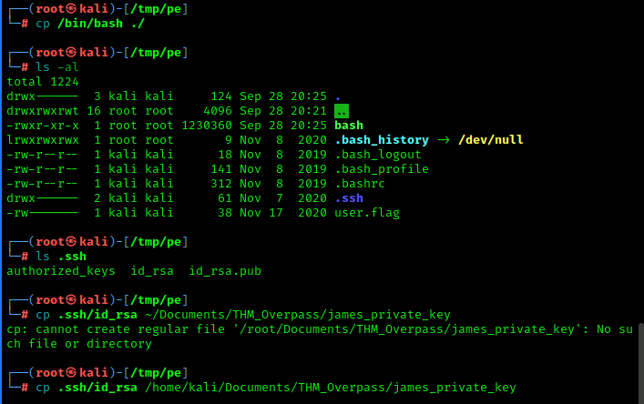
    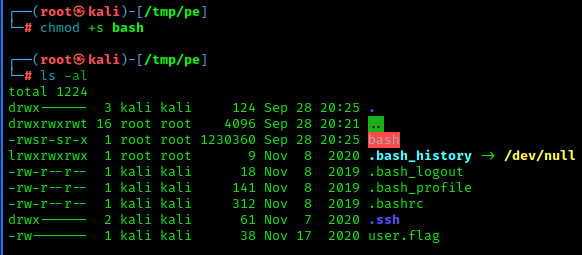

- Now we can SSH using `james_private_key` and we find the `user.flag`

    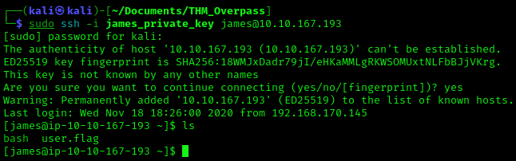

- We can escalate running `bash` which we uploaded, use the `./bash -p` command

    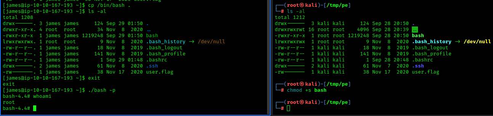

- We are `root`!

- Found the `root` flag at `/root/root.flag` and the web flag at `/usr/share/httpd/web.flag`