# Relevant

## Scope of Work

- The client has asked that you secure two flags (no location provided) as proof of exploitation:
  - User.txt
  - Root.txt

- Scope allowances:
  - All tools permitted but attempt manual exploitation first
  - Locate and note all vulnerabilities found
  - Submit the flags discovered to the dashboard
  - Only the IP address assigned to your machine is in scope
  - Find and report ALL vulnerabilities

## Reconaissance

- Nmap Scan Results
  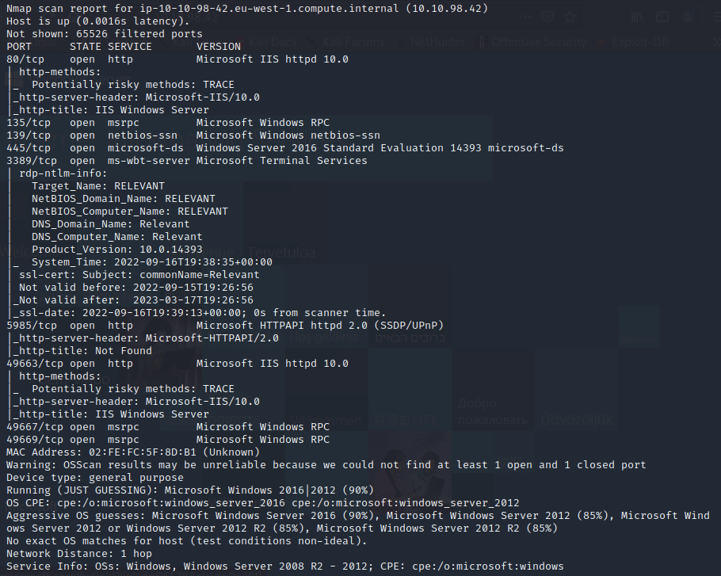
  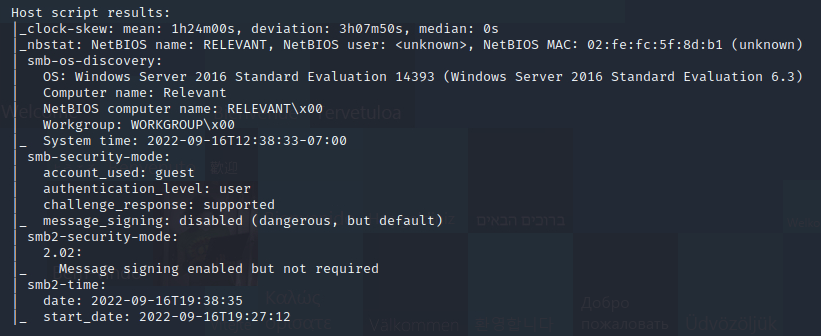

- Navigating to the IP address on a browser, found IIS is running

    

- SMBMAP results

    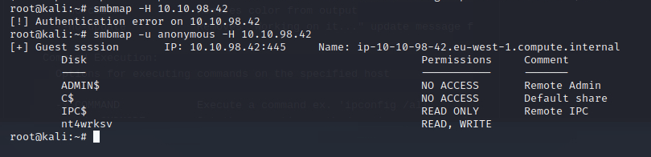

- SMB Vulnerability Scan resulted in finding target is vulnerable to `CVE-2017-0143`

  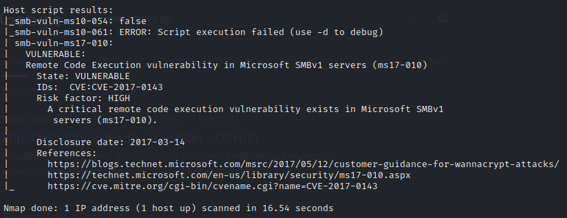

## Initial Access

- Connected to the `nt4wrksv` share and found a `passwords.txt` file

    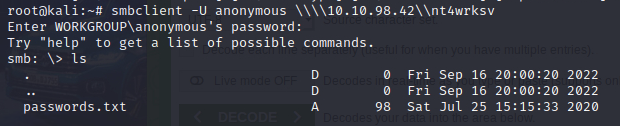

- Got a copy of this file and found encoded passwords

    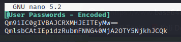

- Decoded the passwords

    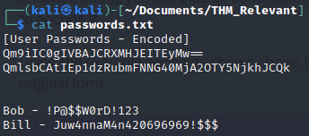

- Created a payload using msfvenom

    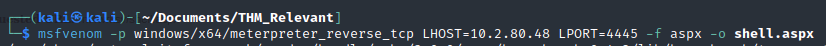

- Meterpreter listener

    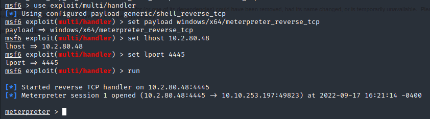

- Payload upload and call

    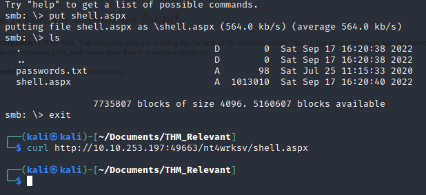

- Found the user flag

    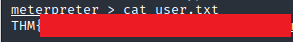

- Check privileges

    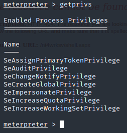

- Using the [PrintSpoofer](https://github.com/dievus/printspoofer) exploit to gain privilege escalation
- Uploaded the `PrintSpoofer.exe` and navigated to the share in `C:\inetpub\wwwroot\nt4wrksv` to run it using the `PrintSpoofer.exe -i -c cmd` command

    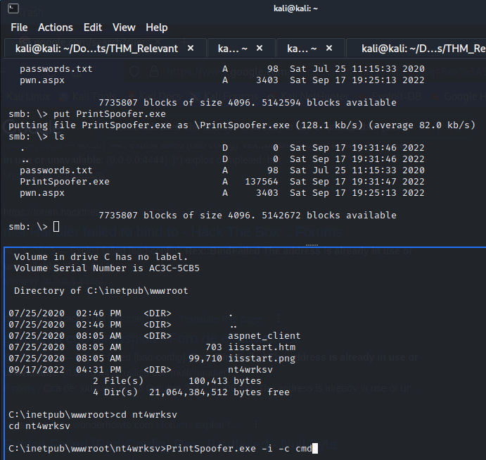

    

- Found root flag

    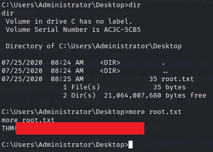
