# Steel Mountain
---

## Initial Access

- Scan the machine with `nmap`

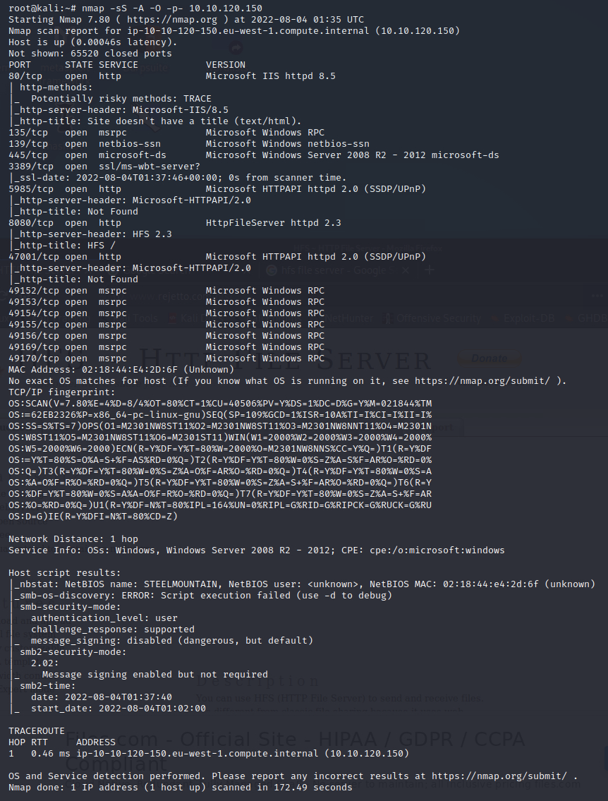

- Found [CVE-2014-6287](https://www.cvedetails.com/cve/CVE-2014-6287/) for this server

- Use `metasploit` to gain an initial shell

- Gained initial shell and found user flag 

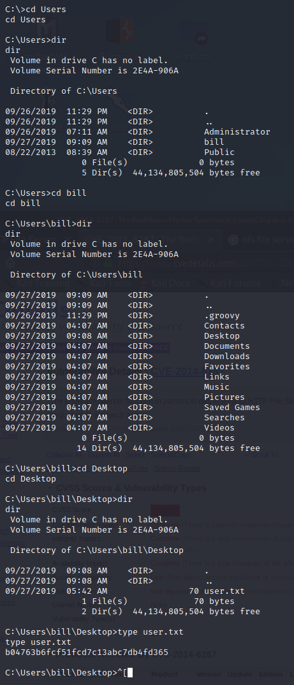

## Privilege Escalation

- Downloaded [PowerUp.ps1](https://github.com/PowerShellMafia/PowerSploit/blob/master/Privesc/PowerUp.ps1) and then uploaded it using metasploit `upload` comamnd

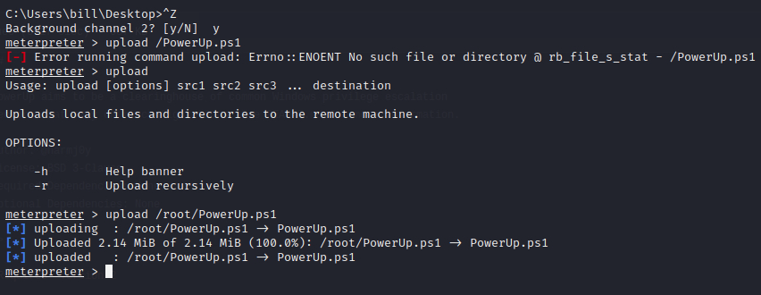

- Execute using Meterpreter, using **load powershell** and **powershell_shell**

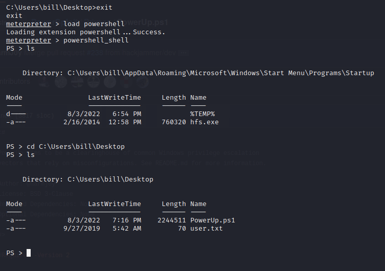

- Ran PowerUp.ps1

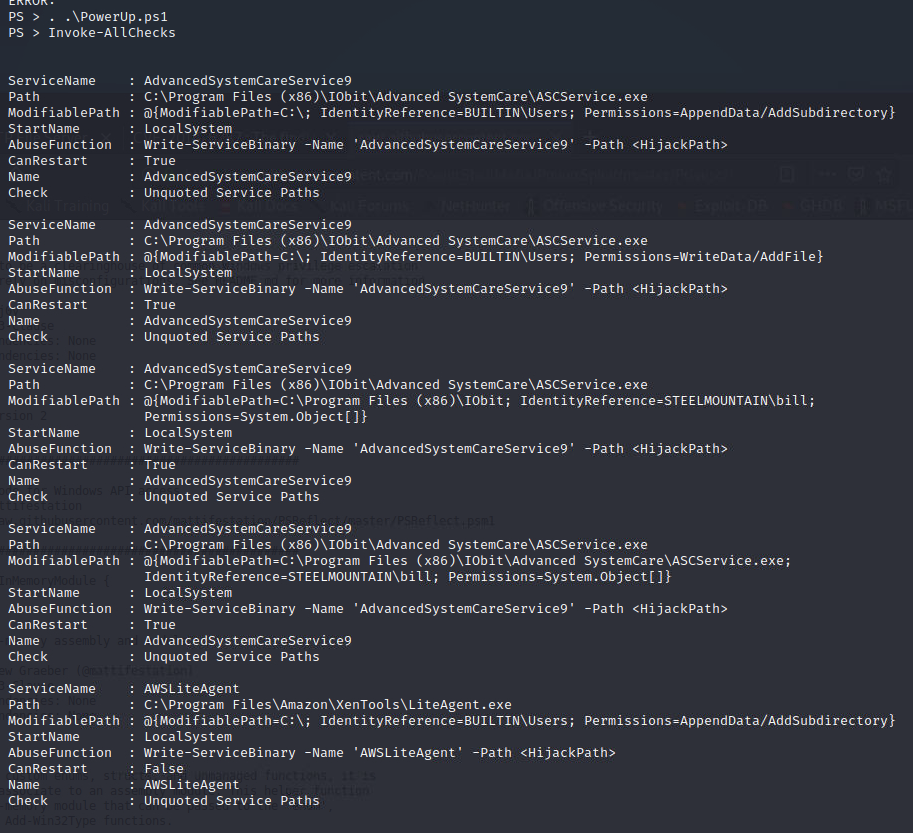

- Found a service with `CanRestart` option set to true. This means we can also write to the directory, replacing it with a malicious one, restart the service and run the infected program. 

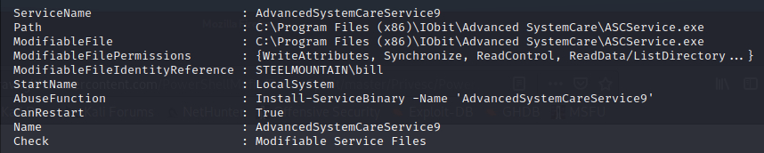

- Use `msfvenom` to create a reverse shell payload as a Windows executable 

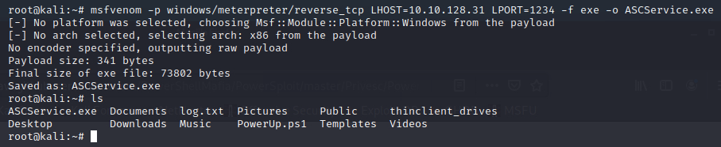

- Setup reverse shell handler

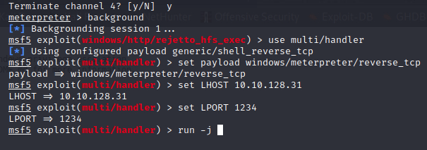

- Stop legitimate service 

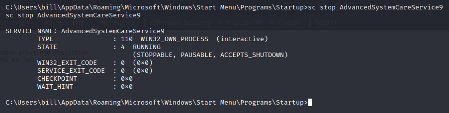

- Upload malicious payload 

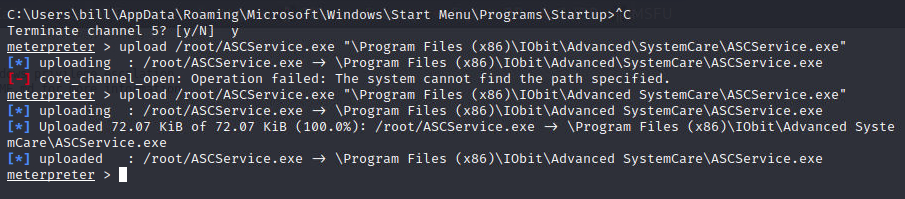

- Start service again

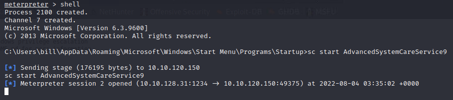

- Once the service is started this should spawn another meterpreter session with the listener we created 

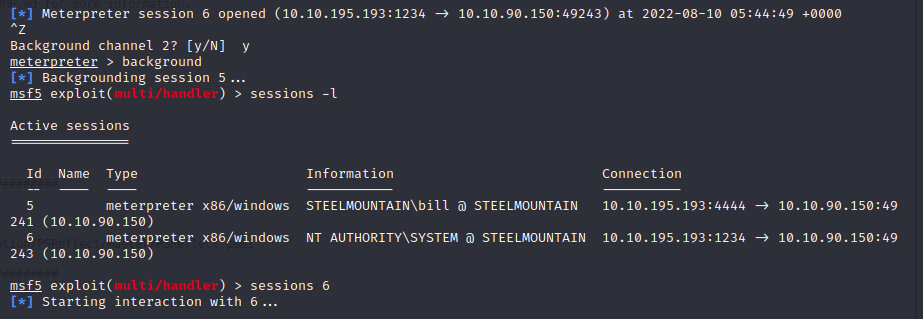