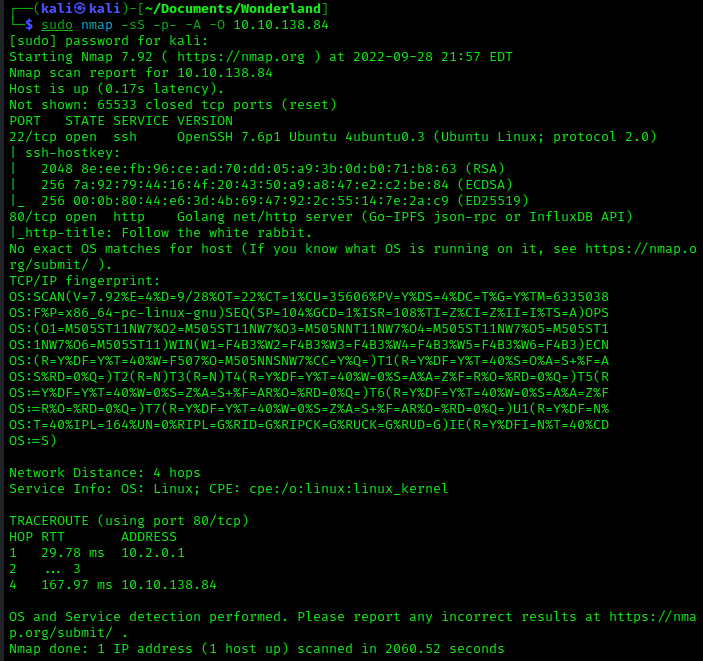
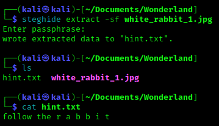
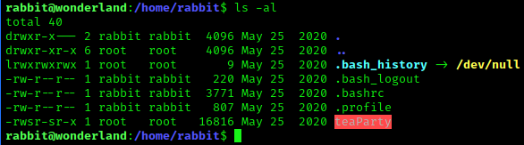
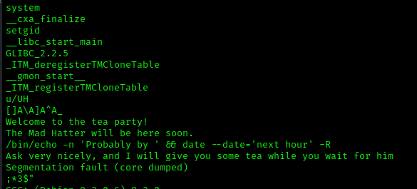
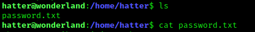
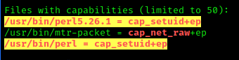
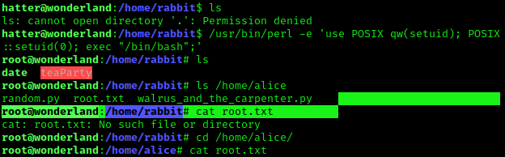

# Wonderland Room

## Recon

- Nmap Scan

    

- Dirsearch results
    - `/r`
    - `/img`


- Download the `white_rabbit_1.jpg` file to see if there is anything hidden

    

- Navigate to that URL

    

- Viewed page source and found some credentials
- Use these to ssh to the box
- We are in! 

- Found the `user.txt` flag in `/root/` directory
- Used `sudo -l` and found we can run a script called `walrus_and_the_carpenter.py` as user `rabbit`
- Found the script in question calls the `random` library but has no absolute path. 
- We create a file called `random.py` that contains the following code
  ```python
  import os
  os.system("/bin/bash")
  ```
- Now we are user `rabbit`

- We find the following in the `/home/rabbit/` directory

    

- We get the `teaParty` file back to Kali and do some inspection and found the following

    

- This calls the `date` command without an absolute path, so we can create a new `date` file to take advantage of this
- Created a fake `date` file that contains the following and made it executable
  ```
  #!/bin/bash
  /bin/bash
  ```

- Ran `./teaParty` again and now we are `hatter`
- There we also find a `password.txt` file

    

- SSH to the machine using username `hatter` and the password found
- Uploaded `linpeas.sh` from my kali machine using `python3 -m http.server`
- Found that perl has `cap_setuid+ep` capability set

    

- Exploit this to gain root using
  `./perl -e 'use POSIX (setuid); POSIX::setuid(0); exec "/bin/bash";'`

- We get `root` and can now get the `root.txt` flag in `/home/alice`

    
